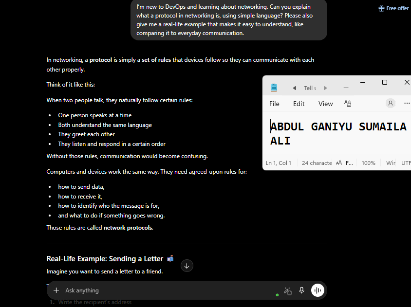
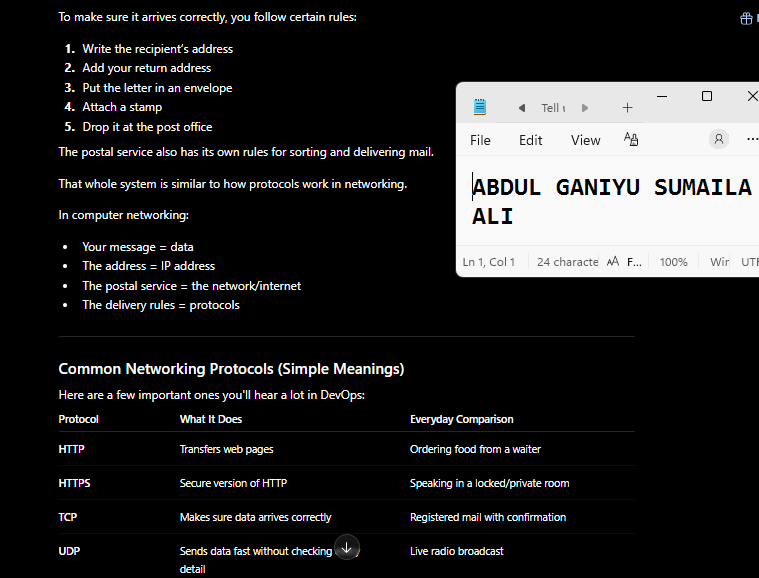
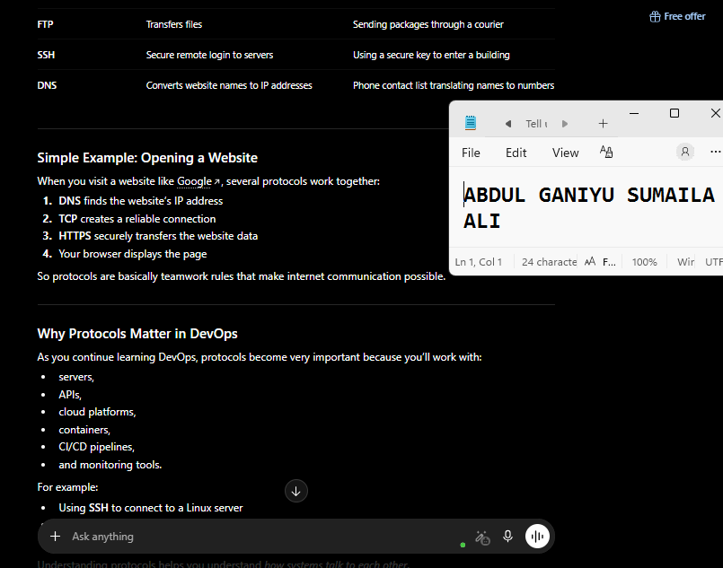
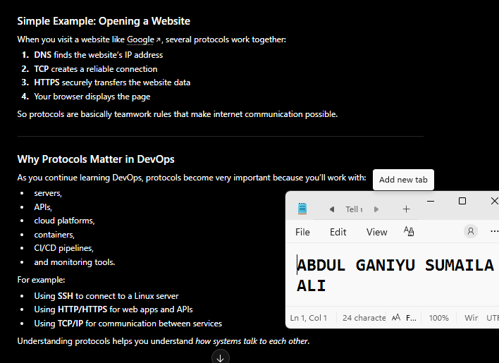
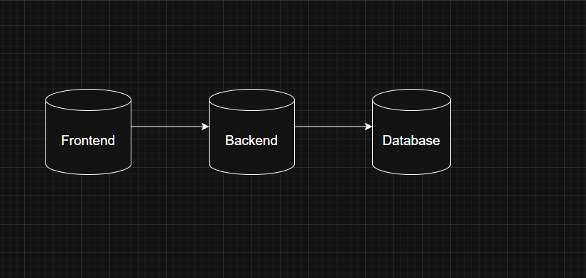
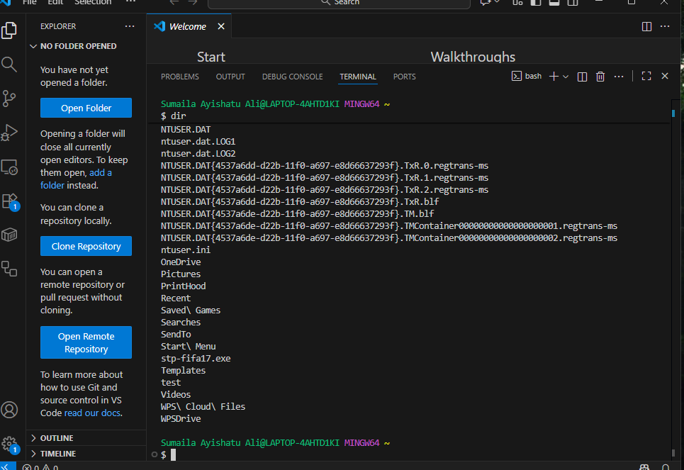

# Week 00 - Internet and Networking

Part of the DevOps Micro Internship (DMI) Cohort 3 with Agentic AI

---

# 🧑‍💻 Task 1: Using ChatGPT as Your Learning Assistant

## Scenario

You're new to DevOps and will frequently encounter technical questions. ChatGPT can be your learning companion.

## Your Task

Write a clear ChatGPT prompt to help you understand:

> "What is a protocol in networking? Explain with a simple real-life example."

Take a screenshot of your interaction showing:

* Your detailed prompt (with clear expectations)
* ChatGPT's simplified response with an example

## Screenshot

Save your screenshot in the `screenshots` folder and update the file name below.

   


Replace `task-1-chatgpt.png` with your actual screenshot file name.

---

## What I Learned (2–3 lines)

One key concept I revisited was networking protocols—the rules devices follow to communicate across networks. A simple real-world example is how people follow conversational rules so communication stays organized and understandable.

---

# 🌐 Task 2: Internet and Networking

## Scenario

Your friend is launching an online bookstore named **EpicReads**.

He asked you to explain how users globally can access his website hosted in Finland.

## Your Task

Write a short explanation (**100–150 words**) that includes:

* Packet Switching
* IP Address
* TCP/IP
* HTTP/HTTPS

💡 **Tip:** You may use ChatGPT (as demonstrated in Task 1) to refine your explanation.

## Answer

When a website is hosted in Finland, users anywhere in the world can access it through the internet using networking protocols. Every device connected to the internet has an IP address, which works like a digital home address. When a user enters a website name, the browser finds the server’s IP address and sends a request using TCP/IP. TCP breaks the data into small pieces called packets, while IP helps route those packets across different networks to the server in Finland. This process is called packet switching because packets may travel through different paths before reaching their destination. The server then responds using HTTP or the secure version, HTTPS, to deliver the website content back to the user’s browser, where it is reassembled and displayed correctly.

---

# 🏗️ Task 3: Application Architecture & Stack

## Scenario

EpicReads bookstore has two application versions:

### Two-Tier Application

* Frontend
* Database

### Three-Tier Application

* Frontend
* Backend
* Database

## Your Task

* Draw simple diagrams (hand-drawn or tool-based such as draw.io)
* Label each layer clearly
* List at least two common technologies or tools used for each layer
* Submit a screenshot or photo clearly showing your own drawing

## Diagram Screenshot / Photo

Save your diagram image in the `screenshots` folder and update the file name below.




Replace `task-3-diagram.png` with your actual diagram file name.

---

## Technologies Used

### Frontend

* HTML/CSS/JavaScript
* React

### Backend

* Node.js
* Django

### Database

* MySQL
* PostgreSQL

---

# 🌍 Task 4: Domain Name & DNS (Basic Concepts)

## Scenario

Your friend's bookstore **EpicReads** is currently accessible through:

```text
52.172.142.222:3000
```

He purchased the domain:

```text
epicreads.com
```

## Your Task

In **50–100 words**, explain in your own words:

1. What is DNS (Domain Name System)?
2. Which DNS record type should be used to connect the domain to the given IP, and why?

## Answer

1. DNS (Domain Name System) is like the internet’s phonebook. It translates easy-to-remember domain names, such as epicreads.com, into IP addresses that computers use to locate servers on the internet. Without DNS, users would have to remember numerical IP addresses to access websites.

2. To connect epicreads.com to the IP address 52.172.142.222, an A Record should be used. An A Record maps a domain name directly to an IPv4 address, allowing users to access the website through the domain instead of typing the server’s IP address. (82 words)

---

# 💻 Task 5: Visual Studio Code Setup (Hands-on)

## Your Task

Install Visual Studio Code (if not already installed).

Take a screenshot of your VS Code environment showing:

* Terminal open inside VS Code
* Running a basic command:

### Windows

```powershell
dir
```

### Linux / macOS

```bash
pwd
ls
```

* Your selected VS Code theme clearly visible

⚠️ **Important:** The screenshot must show your username or another identifiable detail to confirm it is your environment.

## Screenshot

Save your screenshot in the `screenshots` folder and update the file name below.




Replace `task-5-vscode.png` with your actual screenshot file name.

---

# 🔗 Task 6: Publish Your Assignment as a LinkedIn Post

## Objective

Publishing on LinkedIn helps you:

* Build your professional online presence
* Reinforce your learning
* Document your DevOps journey publicly

## Your Task

Summarize your answers from Tasks 1–5 into a LinkedIn post.

Clearly structure your post into the following sections:

* ChatGPT
* Internet & Networking
* App Architecture
* DNS
* VS Code Setup

Add the following credit note at the end of your post:

> **P.S. This post is part of the DevOps Micro Internship (DMI) with Agentic AI — Cohort 3 — by Pravin Mishra. My graded progress is public: https://dmi.pravinmishra.com/s/YOUR-GITHUB-USERNAME.html · Start your DevOps journey: https://dmi.pravinmishra.com/?utm_source=student&utm_medium=ps-linkedin&utm_campaign=cohort3**

---

## LinkedIn Post URL

Paste your LinkedIn post URL here:

```text
https://www.linkedin.com/posts/abdulganiyu0_devops-cloudcomputing-networking-share-7462235332479000577-9twJ/?utm_source=share&utm_medium=member_desktop&rcm=ACoAAFamVAYBbC0P-4_t5y56JbVGUfZFmuyqJnY
```

---

## LinkedIn Post Backup Copy

Paste the full text of your LinkedIn post here:

Behind every website is a chain of networking magic most users never see.

Every strong DevOps engineer needs a solid understanding of networking and application architecture. This week’s DevOps Micro Internship tasks focused on core concepts that power modern applications behind the scenes.

🔹 ChatGPT
One thing I learned is that networking protocols are basically rules that devices follow to communicate over the internet. A simple example is how people follow rules during a conversation so both sides understand each other clearly.
I also learned how users worldwide can access a website hosted in another country through technologies like packet switching, IP addresses, TCP/IP, and HTTP/HTTPS. It made me realize how much happens behind the scenes just by opening a website in a browser.

🌐 Internet & Networking
I explored how data travels across networks in small packets and reaches servers using IP addresses. Understanding TCP/IP and HTTP/HTTPS gave me a clearer picture of how internet communication actually works.

🏗️ App Architecture
I studied the difference between:
• Two-tier architecture (Frontend + Database)
• Three-tier architecture (Frontend + Backend + Database)
I also created diagrams showing how these layers interact and researched common technologies used in each layer.
Frontend:
• Next.js
• Axios
Backend:
• bycrypt.js
• CORS
Database:
• MySQL
• Sequelize

📡 DNS
I learned that DNS (Domain Name System) acts like the internet’s phonebook by converting domain names into IP addresses. To connect the domain epicreads.com to the server IP 52.172.142.222, an A Record should be used because it maps a domain directly to an IPv4 address.

💻 VS Code Setup
I explored Visual Studio Code, opened the integrated terminal, and ran the “dir” command on Windows to navigate files and directories. It was also fun customizing my VS Code theme and getting more comfortable with the development environment.

This internship is helping me build stronger foundations in DevOps step by step, and I’m enjoying the learning process so far.

P.S. This post is part of the DevOps Micro Internship Cohort run by Pravin Mishra [https://lnkd.in/e3knf-G8]. You can start your DevOps journey from his YouTube Playlist [https://lnkd.in/e6_Yaieq]

#DevOps #CloudComputing #Networking #DNS #TCPIP #HTTP #HTTPS #VSCode #SoftwareEngineering #TechLearning #ContinuousLearning #AWS #Linux #DevOpsJourney #TechCommunity

---

# Reflection – Week 0

### What did you find easy?

The VS Code setup and basic terminal tasks were straightforward since I already have experience working with development tools and the command line. Understanding application architecture was also familiar because I've previously worked with cloud and web application concepts during my DevOps and AWS learning journey.

---

### What was difficult?

The networking concepts required a deeper level of understanding than I initially expected. While I was familiar with terms like DNS, TCP/IP, HTTP, and HTTPS, explaining how they all work together in a simple and practical way took some research and critical thinking. I also had to ensure I understood the differences between concepts rather than just memorizing definitions.

---

### What will you improve next week?

Next week, I want to spend more time strengthening my networking fundamentals since they are essential for DevOps and cloud engineering. I also plan to be more proactive with note-taking and documentation so I can retain concepts better and complete assignments more efficiently. Additionally, I want to continue building the habit of learning by doing rather than only consuming content.

---

## 📌 About DMI & CloudAdvisory

DevOps Micro Internship (DMI) is a project-based DevOps program run by Pravin Mishra (The CloudAdvisory) focused on real-world execution, systems thinking, and career readiness.

It helps learners build strong DevOps foundations with hands-on experience.


## 📌 Resources

- 🌐 **DMI Official Website:** https://pravinmishra.com/dmi  
- 🎓 **DevOps for Beginners (Udemy):** https://www.udemy.com/course/devops-for-beginners-docker-k8s-cloud-cicd-4-projects/  
- 🎓 **Ultimate Agentic AI DevOps with Clude Code** https://www.udemy.com/course/ultimate-agentic-ai-devops-with-claude-code/?referralCode=448389767BC96284087B
- 🎓 **DevOps with Claude Code: Terraform, EKS, ArgoCD & Helm** https://www.udemy.com/course/devops-with-claude-code-terraform-eks-argocd-helm/?referralCode=1C5B734505D65A010FA3
- ▶️ **YouTube Playlist (DMI Cohort 3):** https://www.youtube.com/playlist?list=PLFeSNDtI4Cho  
- 🔗 **Pravin Mishra (LinkedIn):** https://www.linkedin.com/in/pravin-mishra-aws-trainer/  
- 🏢 **CloudAdvisory (LinkedIn):** https://www.linkedin.com/company/thecloudadvisory/

---

*This submission is part of DevOps Micro Internship (DMI) Cohort 3 — Agentic AI Track*