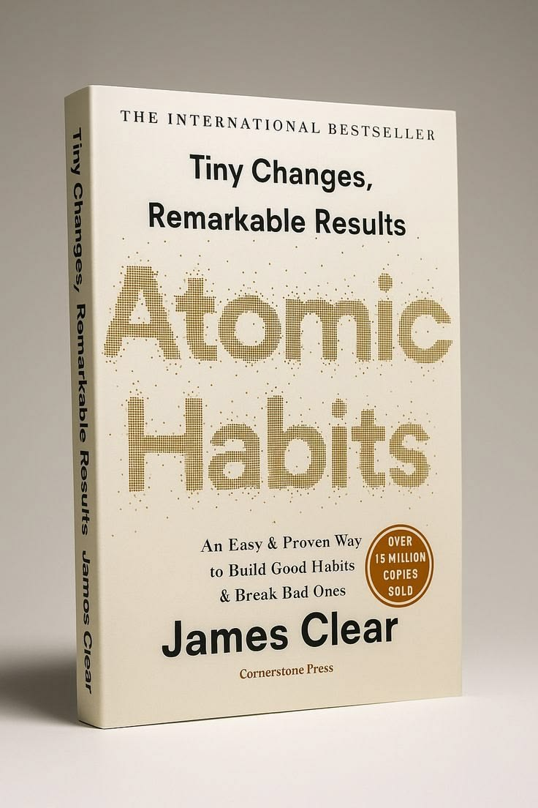

# Week 01 — Success Mindset (Mindset OS)

Part of the DevOps Micro Internship (DMI) Cohort 3 with Agentic AI

---

## Purpose (Read This First)

This week is not motivation homework.

This is you building your **Mindset OS** — the system you will use for the next 5 months (and honestly, for years).

### Expectations

* Be honest.
* Be specific.
* Be practical.
* Write like an adult professional: clear sentences, no one-liners.

You will reuse this in later weeks. So do it properly once.

---

# Assignment 1. What is something you believe to be true that most people around you would disagree with?

### Rules

* No "safe" answers.
* Must be your real belief (not copied from internet).
* Minimum 50 words.

**Hint:** What do you believe about career, money, learning, discipline, relationships, health, success, life, tech industry, etc. that most people don't agree with?

## Answer

I believe that spending years preparing before taking action is often a form of procrastination disguised as productivity.

Many people around me believe they need another course, another certification, or more confidence before they can start something meaningful. My experience has been the opposite. Most of my learning happened after I started working on projects and making mistakes. I learned more troubleshooting AWS deployments, GitHub Actions failures, and Linux configuration issues than I did from simply watching tutorials. I believe progress comes from action first and clarity later, not the other way around.

---

# Assignment 2. What are the top 3 objective truths you discovered through experimentation and results?

### Definition

Objective truths do not depend on opinions. They hold true regardless of how people feel.

Write each truth in this format:

**Truth:** (1 sentence)

**Evidence from my life:** (2–4 lines: what you tried + what happened)

---

## Truth #1

### Truth

Consistent effort produces better results than short bursts of motivation.

### Evidence from my life

There were many periods when I was not motivated to study Cloud and DevOps, especially while unemployed and applying for jobs. However, whenever I consistently spent time learning and building projects, I made measurable progress. My AWS capstone project was completed through steady effort over time, not through motivation.

---

## Truth #2

### Truth

Most technical problems become solvable if you stay with them long enough.

### Evidence from my life

While working on GitHub Actions deployment to AWS EC2, I faced repeated SSH authentication errors. I spent days troubleshooting, researching documentation, testing solutions, and asking questions. Eventually I solved the issue and completed the deployment. The solution was not intelligence; it was persistence.

---

## Truth #3

### Truth

People cannot help you if they do not know your situation.

### Evidence from my life

When I was initially left out of the DMI selected list due to a misunderstanding about my interview attendance, I followed up respectfully instead of assuming the decision was final. That follow-up led to clarification and eventually my acceptance into the cohort. Had I remained silent, the outcome would have been very different.

---

# Assignment 3. What does your 2.0 version look like?

### Instructions

Write as if a journalist is writing about you **3 to 7 years from now** (not 20 years).

**Minimum 300 words.**

### Rules

* Write in past tense, like it already happened.
* Don't use "likes to / wants to / hopes to."
* Use specifics:

  * built
  * shipped
  * led
  * published
  * earned
  * relocated
  * contributed
* Include skills proof:

  * projects
  * portfolios
  * GitHub
  * blogs
  * certifications
  * job role
  * leadership
  * community contribution
* Add 1–3 images if you can (optional but powerful).

### Publish It Publicly On Any ONE

* LinkedIn
* Medium
* WordPress
* Blogspot
* Personal blog
* Portfolio page

Include this line:

> **P.S. This post is a part of DevOps Micro Internship with Agentic AI Cohort-3 by [Pravin Mishra](https://www.linkedin.com/in/pravin-mishra-aws-trainer/). You can start your DevOps journey by joining this [Discord community](https://discord.pravinmishra.com/) ( https://discord.pravinmishra.com/ ).**

## Your Article

From Customer Support to Cloud & DevOps: How Abdul Ganiyu Built a Career Through Consistency

In 2030, Abdul Ganiyu Sumaila Ali is recognized as a Cloud and DevOps Engineer who built his career through persistence, hands-on learning, and a commitment to continuous improvement.

His journey did not begin in technology. Before transitioning into Cloud and DevOps, Abdul worked in customer support and logistics roles where he developed strong communication, problem-solving, and customer relationship skills. While those experiences were valuable, he became increasingly interested in the technology powering modern businesses and decided to pursue a career change.

Rather than relying solely on certifications and courses, Abdul focused on building projects and documenting his work publicly. He deployed cloud-based applications, automated deployments, worked with Infrastructure as Code, and published detailed project documentation on GitHub. His portfolio became a practical demonstration of his skills and helped him stand out in a competitive job market.

A major turning point came when he joined the DevOps Micro Internship (DMI) Cohort 3 with Agentic AI. The program strengthened his technical foundation in Cloud, DevOps, automation, and modern AI-assisted engineering workflows. More importantly, it taught him how to think like an engineer by solving real-world problems through projects and assignments.

Over the years, Abdul earned industry-recognized cloud certifications, contributed to open-source projects, and shared lessons from his learning journey through LinkedIn articles and technical blogs. His GitHub profile evolved into a collection of practical cloud and automation projects that reflected his growth as an engineer.

Today, Abdul works in a Cloud and DevOps role where he helps build, deploy, and maintain reliable cloud infrastructure. He is known for combining technical expertise with strong communication skills, enabling him to bridge the gap between users, business needs, and technology teams.
His story serves as a reminder that career transitions are possible when learning is combined with action, consistency, and a willingness to embrace challenges. What started as curiosity eventually became a profession built on practical experience, continuous learning, and the determination to keep moving forward.

P.S. This post is a part of DevOps Micro Internship with Agentic AI Cohort-3 by Pravin Mishra. You can start your DevOps journey by joining this Discord community (https://lnkd.in/drhtPMDS).

### Public Link

(https://www.linkedin.com/posts/abdulganiyu0_from-customer-support-to-cloud-devops-share-7478536020154839040-tvKR/?utm_source=share&utm_medium=member_desktop&rcm=ACoAAFamVAYBbC0P-4_t5y56JbVGUfZFmuyqJnY)

`__________________________`

---

# Assignment 4. Have you ever cut corners (unethical / dishonest / shortcut behavior — not necessarily illegal)? If yes, how did it make you feel?

### Important

You don't need to write the full story.

Focus on the feeling:

* guilt
* fear
* shame
* stress
* regret
* numbness
* etc.

This is about self-awareness, not judgment.

### Answer Format

**Yes**

If Yes:

**What emotion did you feel?** (minimum 50–100 words)

## Answer

There have been times when I took shortcuts instead of putting in the full effort required. One example is applying for jobs without thoroughly tailoring my CV or researching the company because I was focused on submitting as many applications as possible. While it saved time in the short term, it often left me feeling dissatisfied because I knew I had not given myself the best chance of success.

The main emotions I felt were regret and frustration. Regret because I knew I could have done better, and frustration because the outcomes usually reflected the effort I put in. Those experiences taught me that shortcuts may provide temporary convenience, but they rarely produce the results I actually want. Over time, I have become more intentional about doing things properly, even when it takes longer.

---

# Assignment 5. What are 10 non-fiction books you plan to read in the next 1 year?

### Rules

* Mention **Title + Author**
* Any language allowed
* No fiction novels

### Tip

Choose books that improve:

* mindset
* communication
* productivity
* health
* money
* career
* leadership

## Book List

1. Atomic Habits — James Clear

2. Deep Work — Cal Newport

3. The Psychology of Money — Morgan Housel

4. So Good They Can't Ignore You — Cal Newport

5. The 7 Habits of Highly Effective People — Stephen R. Covey

6. The First 90 Days — Michael D. Watkins

7. The Lean Startup — Eric Ries

8. The Effective Engineer — Edmond Lau

9. The Phoenix Project — Gene Kim, Kevin Behr & George Spafford

10. The DevOps Handbook — Gene Kim, Jez Humble, Patrick Debois & John Willis

---

# Assignment 6. What are the things you will measure regularly in your life and career?

### Rules

List topics only. No need to share numbers.

### Must Include

* Learning / skill
* Output / proof
* Health / energy
* Time / focus
* Money / finance (personal or business)

### Example

* Learning hours per week
* Deep work sessions per week
* Projects shipped / documented
* Steps / workouts
* Sleep hours
* Spending tracker

## My Metrics

* Learning hours per week
* DMI assignments completed
* Cloud/DevOps projects completed
* GitHub commits and project updates
* Technical articles or posts published
* Job applications submitted
* Interview invitations received
* Monthly savings and expenses
* Sleep hours per night
* Weekly exercise or walking sessions

---

# Assignment 7. Brain Dump + 5-Month System Plan

## Step 1: Brain Dump (Private)

Do a brain dump of everything in your mind into a notebook.

Examples:

* Bills
* Tasks
* Worries
* Goals
* Pending messages
* Ideas
* Responsibilities

### Did You Do It?

**Yes**

Answer:

I completed a brain dump covering my career goals, DMI commitments, job search activities, financial responsibilities, learning objectives, pending tasks, and personal priorities.

---

## Step 2: Your 5-Month Routine + Focus Blocks

Create a simple plan you can realistically follow for the next 5 months.

### Weekly Routine

Example:

* Mon–Thu: 60 min deep work
* Sat: DMI session
* Sun: Weekly review

#### My Weekly Routine

Monday–Thursday: 1–2 hours of focused DMI study and assignment work
Saturday: Attend DMI live sessions and take notes
Sunday: Review weekly progress, organize notes, and prepare for the next week
Daily: Read or learn something related to Cloud, DevOps, or AI

---

### Focus Blocks

#### When Will You Do DMI Work? (Days + Time)

Monday–Thursday: 8:00 PM – 10:00 PM
Sunday: 4:00 PM – 6:00 PM for review and planning

#### How Many Sessions Per Week?

Minimum of 5 focused study/work sessions per week

---

### Distraction Rules

Examples:

* Phone rules
* Social media rules
* Environment setup

#### My Distraction Rules

Keep phone on silent during study sessions
No social media during focus blocks
Study with only the required tabs and applications open
Complete planned tasks before consuming entertainment content
Track unfinished tasks and review them every Sunday
---

# Reflection – Week 1

### Biggest insight I got about myself this week

I perform better when I have structure and accountability. When expectations are clear and there is a defined goal, I am more likely to stay consistent and make progress.

### My biggest weakness/loop I noticed

I sometimes spend too much time preparing, researching, or thinking about the best approach instead of starting immediately and learning through action.

### One system I will implement from this week (exact habit + time)

Every weekday at 8:00 PM, I will begin a 90-minute focused DMI work session before checking social media, watching videos, or engaging in other non-essential activities.

### LinkedIn Post

(https://www.linkedin.com/posts/abdulganiyu0_from-customer-support-to-cloud-devops-share-7478536020154839040-tvKR/?utm_source=share&utm_medium=member_desktop&rcm=ACoAAFamVAYBbC0P-4_t5y56JbVGUfZFmuyqJnY)

`__________________________`

---

## 10. Proof of Work

- LinkedIn Post URL: **[Linkedin](https://www.linkedin.com/posts/abdulganiyu0_from-customer-support-to-cloud-devops-share-7478536020154839040-tvKR/?utm_source=share&utm_medium=member_desktop&rcm=ACoAAFamVAYBbC0P-4_t5y56JbVGUfZFmuyqJnY)**  
- Blog / Medium : **[Medium](https://medium.com/@alisumaila.1000/from-customer-support-to-cloud-devops-how-abdul-ganiyu-built-a-career-through-consistency-0badac26bbfd)**  

---

## 📌 About DMI & CloudAdvisory

DevOps Micro Internship (DMI) is a project-based DevOps program run by Pravin Mishra (The CloudAdvisory) focused on real-world execution, systems thinking, and career readiness.

It helps learners build strong DevOps foundations with hands-on experience.

## 📌 Resources

- 🌐 **DMI Official Website:** https://pravinmishra.com/dmi  
- 🎓 **DevOps for Beginners (Udemy):** https://www.udemy.com/course/devops-for-beginners-docker-k8s-cloud-cicd-4-projects/  
- 🎓 **Ultimate Agentic AI DevOps with Clude Code** https://www.udemy.com/course/ultimate-agentic-ai-devops-with-claude-code/?referralCode=448389767BC96284087B
- 🎓 **DevOps with Claude Code: Terraform, EKS, ArgoCD & Helm** https://www.udemy.com/course/devops-with-claude-code-terraform-eks-argocd-helm/?referralCode=1C5B734505D65A010FA3
- ▶️ **YouTube Playlist (DMI Cohort 3):** https://www.youtube.com/playlist?list=PLFeSNDtI4Cho  
- 🔗 **Pravin Mishra (LinkedIn):** https://www.linkedin.com/in/pravin-mishra-aws-trainer/  
- 🏢 **CloudAdvisory (LinkedIn):** https://www.linkedin.com/company/thecloudadvisory/

---

*This submission is part of DevOps Micro Internship (DMI) Cohort 3 — Agentic AI Track*