# Assignment 3 — Production Maintenance Drill (OPS Checklist)

Part of the DevOps Micro Internship (DMI) Cohort 3 with Agentic AI

---

## Purpose

In this assignment, you will treat your already deployed React application (on Ubuntu VM with Nginx) as a live production system. You will perform structured operational checks covering network validation, service health, log analysis, resource monitoring, configuration verification, and incident simulation with recovery — mirroring real on-call DevOps responsibilities.

---

# Task 1 — Server Access & Networking Validation

## Goal

Verify that the deployed React application is reachable from the browser and confirm basic network connectivity of the Ubuntu VM.

### Evidence

#### Screenshot 1 — Browser showing the React app with your Full Name visible on the UI

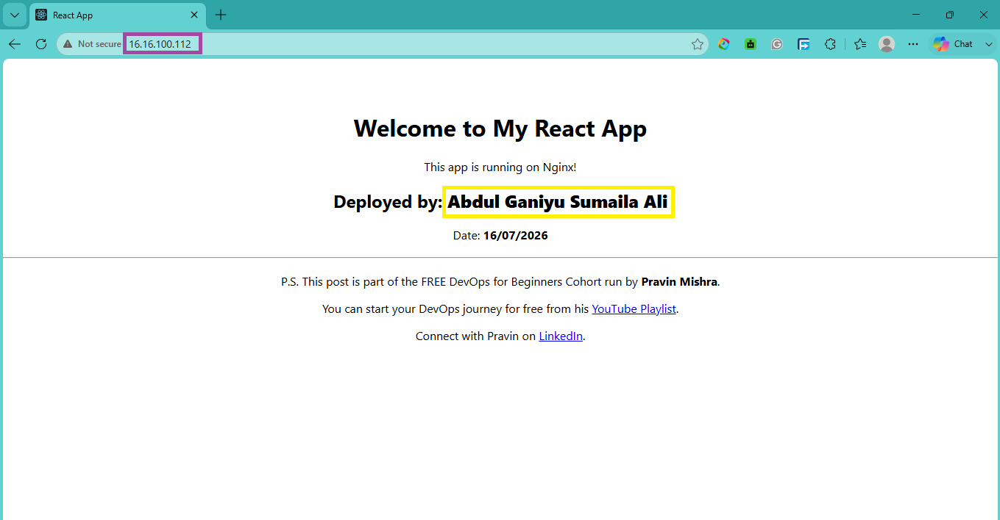

---

#### Screenshot 2 — Output of `ip a`

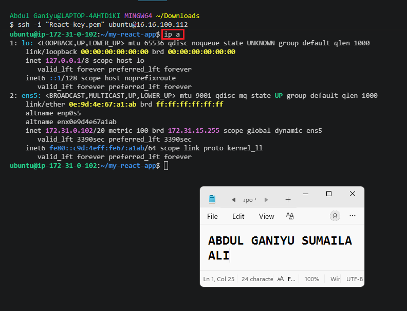

---

#### Screenshot 3 — Output of `sudo ss -tulpen`

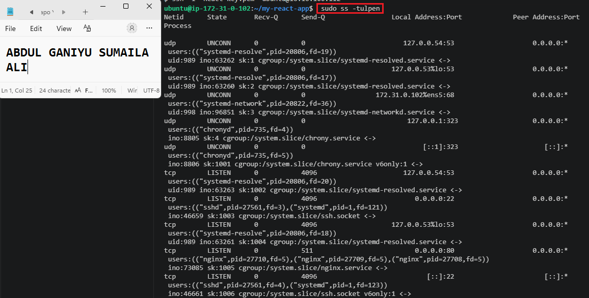 

---

#### Screenshot 4 — Output of `sudo ufw status`

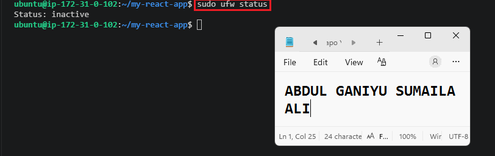

---

### Notes

Answer the following in your own words:

**1. What proves Nginx is listening on 0.0.0.0:80?**

The sudo ss -tulpen output showed Nginx listening on 0.0.0.0:80. The 0.0.0.0 address means Nginx is accepting connections on all network interfaces, while port 80 is the default HTTP port. This confirms that the web server is available to users accessing the server through its public IP address.
---

**2. What proves SSH is active on port 22?**

The sudo ss -tulpen output showed the SSH daemon (sshd) listening on 0.0.0.0:22 and [::]:22. This confirms that SSH is running and accepting remote connections on port 22 over both IPv4 and IPv6 networks.

---

**3. Did you find any unexpected open ports? Explain briefly.**

No, I did not find any unexpected open ports. Besides SSH on port 22 and Nginx on port 80, I noticed ports used by standard Ubuntu services such as systemd-resolved (DNS on port 53), systemd-networkd (DHCP on port 68), and chronyd (time synchronization on port 323). These are normal system services and not something I intentionally configured, but they are expected on a typical Ubuntu server.

---

# Task 2 — Service Health & Systemd Validation (Nginx)

## Goal

Verify that Nginx is properly installed, running, enabled at boot, and safely configured.

### Evidence

#### Screenshot 1 — Output of `systemctl status nginx --no-pager`

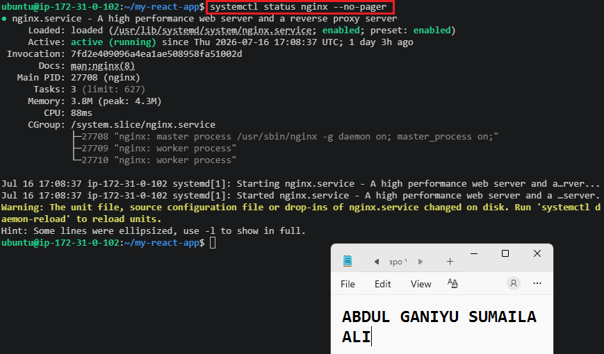

---

#### Screenshot 2 — Output of `sudo nginx -t`

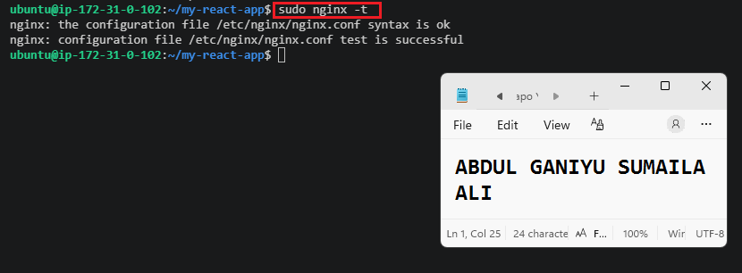

---

#### Screenshot 3 — Output of `sudo ss -lptn '( sport = :80 )'`

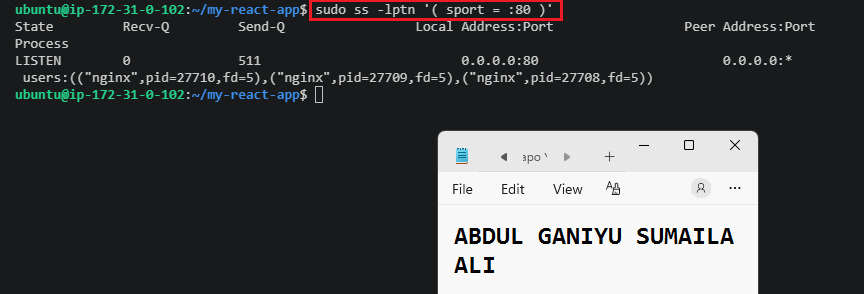

---

### Notes

Answer the following in your own words:

**1. What happens if Nginx fails to restart in production?**

If Nginx fails to restart in production, users may be unable to access the website or application being served by Nginx. Any new configuration changes would not take effect, and the service could become unavailable if Nginx stops completely. This is why it's important to test configurations before restarting and check error logs when issues occur.

---

**2. What's your basic rollback plan?**

My rollback plan is to restore the last known working Nginx configuration or application build, test the configuration using sudo nginx -t, restart Nginx, and verify that the service is running correctly. If the issue was caused by a deployment, I would redeploy the previous working version before investigating the root cause.

---

# Task 3 — Logs & Request Trace

## Goal

Verify real traffic flow and analyze logs to understand system behavior and errors.

### Evidence

#### Screenshot 1 — Output of `sudo tail -n 30 /var/log/nginx/access.log`

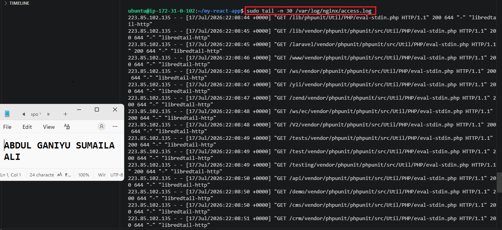 

---

#### Screenshot 2 — Output of `sudo tail -n 30 /var/log/nginx/error.log`

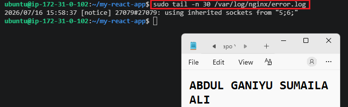 

---

#### Screenshot 3 — Output of `sudo journalctl -u nginx --no-pager -n 50`

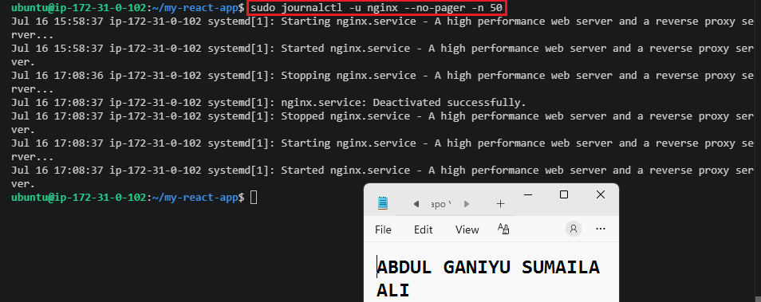 

---

### Notes

Answer the following in your own words:

**1. Were there any errors in the logs?**

- If yes, mention 1–2 example error lines from the logs and explain what each one means in simple terms.
- If no, explain what it means if the error log is empty or shows no recent errors during your check.

I did not find any critical errors in the Nginx error log during my check. The only recent entry was:

2026/07/16 15:58:37 [notice] 27079#27079: using inherited sockets from "5;6;"

This is a notice rather than an error. It indicates that Nginx reused existing network sockets during a reload or restart, allowing it to continue serving traffic without interruption. Since there were no actual error messages, it suggests that Nginx was running normally at the time of my inspection.

---

**2. If there were no errors, what does that indicate about the system?**

If the error log shows no recent errors, it generally indicates that Nginx is operating correctly and handling requests without major problems. It suggests that the web server configuration is valid, the service is stable, and there are no obvious issues preventing users from accessing the application. However, it does not guarantee that everything is perfect, so access logs and application behavior should also be checked.

---

**3. Based on the access logs, were your curl requests visible in the log entries? What does that prove about traffic flow?**

Yes, my curl request was visible in the access log. I found the following entry:

16.16.100.112 - - [17/Jul/2026:22:42:05 +0000] "HEAD / HTTP/1.1" 200 0 "-" "curl/8.18.0"

This proves that the request successfully reached the Nginx server, was processed, and received a 200 OK response. It also confirms that traffic is flowing correctly between the client and the web server, and that Nginx is logging incoming requests as expected.

---

# Task 4 — System Resource Health Check (Capacity Red Flags)

## Goal

Assess server capacity and detect potential performance or failure risks.

### Evidence

#### Screenshot 1 — Output of `uptime`

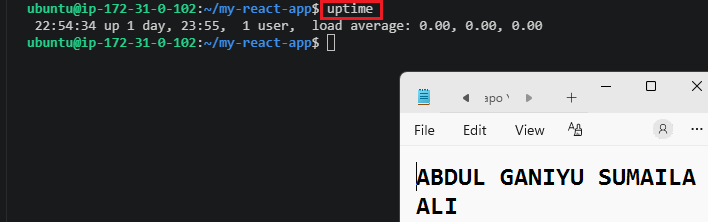

---

#### Screenshot 2 — Output of `free -h`

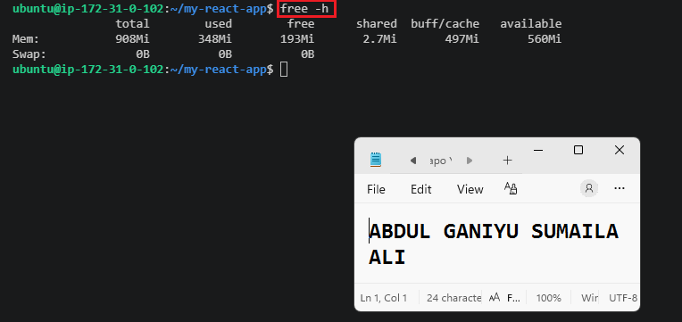

---

#### Screenshot 3 — Output of `df -h`

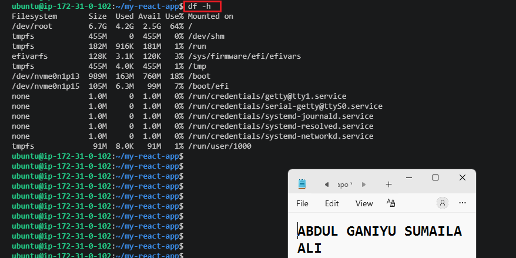

---

#### Screenshot 4 — Output of `sudo du -sh /var/* | sort -h`

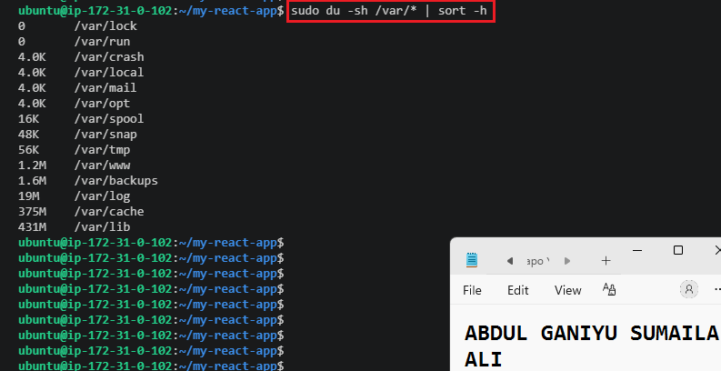

---

### Notes

Answer the following in your own words:

**1. Which resource looks most critical right now? (CPU/load, memory, or disk) Explain why.**

Write your answer here.

---

**2. What happens if disk becomes 100% full in a production server?**

Write your answer here.

---

# Task 5 — Configuration & Deployment Verification

## Goal

Ensure the correct React build is deployed and Nginx is serving it properly.

### Evidence

#### Screenshot 1 — Output of `ls -lah /var/www/html | head -n 20`

Add your screenshot here.

---

#### Screenshot 2 — Output of `grep -R "Deployed by" -n /var/www/html 2>/dev/null | head`

Add your screenshot here.

---

#### Screenshot 3 — Output of `grep -n "try_files" /etc/nginx/sites-available/default`

Add your screenshot here.

---

### Notes

Answer the following in your own words:

**1. How do you confirm that the correct version of the application is deployed?**

Write your answer here.

---

# Task 6 — Nginx Configuration Failure Simulation

## Goal

Simulate a real-world Nginx misconfiguration and recover the service safely.

### Evidence

#### Screenshot 1 — Output of `sudo nginx -t` showing the syntax error (broken config)

Add your screenshot here.

---

#### Screenshot 2 — Output of `sudo nginx -t` showing syntax ok (fixed config)

Add your screenshot here.

---

#### Screenshot 3 — Output of `curl -I http://<public-ip>` confirming recovery (200 OK)

Add your screenshot here.

---

### Notes

Answer the following in your own words:

**1. What caused the configuration failure?**

Write your answer here.

---

**2. How did you fix the issue?**

Write your answer here.

---

**3. How can you avoid this kind of issue in real production systems?**

Write your answer here.

---

# Task 7 — Web Application Failure Simulation

## Goal

Simulate missing deployment content and recover the application safely.

### Evidence

#### Screenshot 1 — Output of `curl -I http://<public-ip>` showing failure (non-200 response)

Add your screenshot here.

---

#### Screenshot 2 — Output of `curl -I http://<public-ip>` confirming recovery (200 OK)

Add your screenshot here.

---

### Notes

Answer the following in your own words:

**1. What caused the application to break in this scenario?**

Write your answer here

---

**2. How did you fix the issue and restore the application?**

Write your answer here.

---

**3. What steps would you take to prevent this kind of issue in real production systems?**

Write your answer here.

---

# Task 8 — Security & Reliability Review

## Goal

Review and reflect on the security and reliability practices applied during this assignment.

### Security & Reliability Notes

Answer the following in your own words:

**1. Why is SSH key-based authentication more secure than sharing passwords?**

Write your answer here.

---

**2. Why should only required ports be open on a production server?**

Write your answer here.

---

**3. Why is it important for Nginx to be enabled on boot?**

Write your answer here.

---

**4. What are the risks of sharing secrets, keys, or credentials publicly?**

Write your answer here.

---

**5. Why should cloud resources be stopped or terminated when they are no longer needed?**

Write your answer here.

---

# LinkedIn Post (Required)

## Evidence

#### LinkedIn Post URL

Paste your LinkedIn post URL here:

`Add your URL here`

---

#### Screenshot — Published LinkedIn post

Add your screenshot here.

---

# Submission Instructions

- Add all required screenshots in your submission
- Full name must be visible in required screenshots
- Do not expose sensitive information (keys, passwords, account IDs)

---

# Completion Checklist

- [ ] Task 1: Screenshots (browser, ip a, ss -tulpen, ufw status) + Notes answered
- [ ] Task 2: Screenshots (nginx status, nginx -t, ss port 80) + Notes answered
- [ ] Task 3: Screenshots (access log, error log, journalctl) + Notes answered
- [ ] Task 4: Screenshots (uptime, free -h, df -h, du -sh) + Notes answered
- [ ] Task 5: Screenshots (ls html, grep deployed by, grep try_files) + Notes answered
- [ ] Task 6: Screenshots (nginx -t fail, nginx -t pass, curl recovery) + Notes answered
- [ ] Task 7: Screenshots (curl failure, curl recovery) + Notes answered
- [ ] Task 8: Security & Reliability Notes answered
- [ ] LinkedIn post published and URL submitted
- [ ] Full Name visible in all required screenshots
- [ ] No sensitive data exposed

---

## 📌 About DMI & CloudAdvisory

DevOps Micro Internship (DMI) is a project-based DevOps program run by Pravin Mishra (The CloudAdvisory) focused on real-world execution, systems thinking, and career readiness.

It helps learners build strong DevOps foundations with hands-on experience.

---

## 📌 Resources

- 🌐 DMI Official Website: https://pravinmishra.com/dmi  
- 🎓 DevOps for Beginners (Udemy): https://www.udemy.com/course/devops-for-beginners-docker-k8s-cloud-cicd-4-projects/  
- 🎓 Agentic AI DevOps with Claude Code: https://www.udemy.com/course/ultimate-agentic-ai-devops-with-claude-code/  
- 🎓 DevOps with Claude Code: Terraform, EKS, ArgoCD & Helm: https://www.udemy.com/course/devops-with-claude-code-terraform-eks-argocd-helm/  
- ▶️ YouTube Playlist: https://www.youtube.com/playlist?list=PLFeSNDtI4Cho  
- 🔗 Pravin Mishra (LinkedIn): https://www.linkedin.com/in/pravin-mishra-aws-trainer/  
- 🏢 CloudAdvisory (LinkedIn): https://www.linkedin.com/company/thecloudadvisory/

---

*This submission is part of DevOps Micro Internship (DMI) Cohort 3 — Agentic AI Track.*