# Assignment 5 — Bash Script Automation Drill (OPS Checklist)

Part of the DevOps Micro Internship (DMI) Cohort 3 with Agentic AI

---

## Purpose

In this assignment, you will practice Bash scripting by building a series of small automation scripts covering environment setup, variables, arrays, loops, file conditionals, if-else logic, and functions. These scripts form the foundation of real-world Linux automation used in DevOps, cloud, and production support environments.

---

# Task 1 — Bash Environment & Workspace Setup

## Goal

Verify that Bash is available on your system and create a clean workspace for this assignment.

### Evidence

#### Screenshot 1 — Output of `echo $SHELL` and `bash --version`

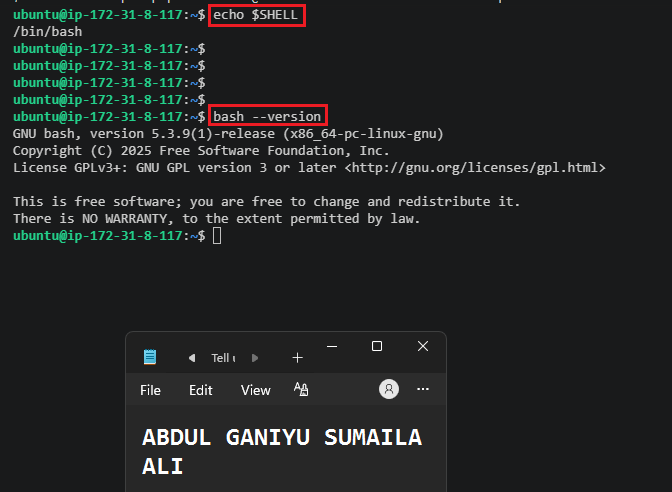

---

#### Screenshot 2 — Output of `pwd` and `ls -lah` showing the scripts directory

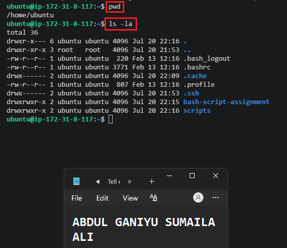

---

### Notes

Answer the following in your own words:

**1. What is Bash?**

Bash (Bourne Again Shell) is a command-line interpreter that allows users to interact with a Linux system by typing commands. It can be used to manage files, run programs, automate tasks, and create scripts that execute multiple commands automatically. Bash is the default shell on many Linux distributions and is widely used by system administrators and DevOps engineers.

---

**2. What is the difference between shell and Bash?**

A shell is a general program that provides an interface between the user and the operating system. There are different types of shells, such as Bash, Zsh, Fish, and KornShell. Bash is one specific type of shell and is one of the most commonly used because it supports scripting, automation, and a wide range of commands. In simple terms, all Bash programs are shells, but not all shells are Bash.

---

**3. Why is it important to confirm the Bash version before writing scripts?**

It is important to check the Bash version because some commands and features are only available in certain versions. A script that works correctly on a newer version of Bash may fail on an older version that does not support the same functionality. Confirming the version helps ensure compatibility, reduces troubleshooting time, and makes scripts more reliable when running on different systems.

---

# Task 2 — Your First Bash Script

## Goal

Create your first Bash script, make it executable, and run it from the terminal.

### Evidence

#### Screenshot 1 — Content of `first-script.sh`

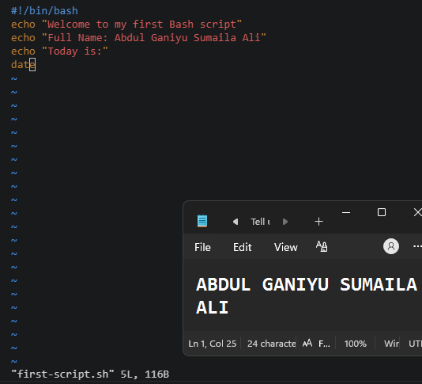

---

#### Screenshot 2 — Output of `./first-script.sh`

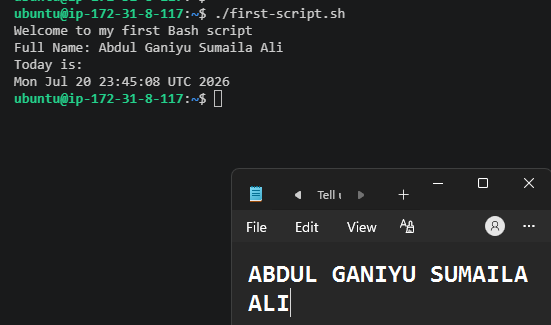

---

#### Screenshot 3 — Output of `ls -l first-script.sh` showing executable permission

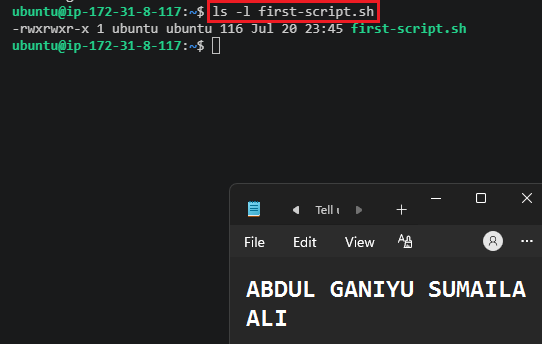

---

### Notes

Answer the following in your own words:

**1. What is the purpose of `#!/bin/bash`?**

#!/bin/bash is called a shebang. It tells the operating system which interpreter should be used to run the script. When a script starts with #!/bin/bash, the system knows to execute the commands in the file using the Bash shell. This helps ensure the script runs in the correct environment and behaves as expected.

---

**2. Why do we use `chmod +x` before running a script?**

The chmod +x command makes a script executable. By default, a script file may only be readable or writable, but not executable. Adding the execute (x) permission allows the operating system to treat the file as a program that can be run directly.

---

**3. What is the difference between running a script using `./script.sh` and `bash script.sh`?**

When using ./script.sh, the script is executed directly and relies on the shebang (#!/bin/bash) to determine which interpreter to use. The script must also have execute permissions.

When using bash script.sh, Bash is explicitly called to run the script, so execute permissions are not required. In this case, Bash runs the file regardless of whether it contains a shebang. This method is often useful for testing scripts before making them executable.

---

# Task 3 — Variables: User Information Script

## Goal

Use variables to store and display user-related information.

### Evidence

#### Screenshot 1 — Content of `user-info.sh`

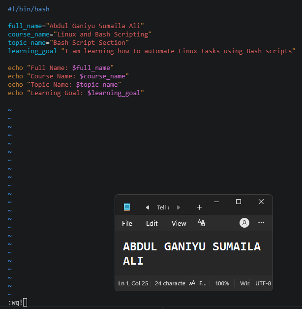

---

#### Screenshot 2 — Output of `./user-info.sh`

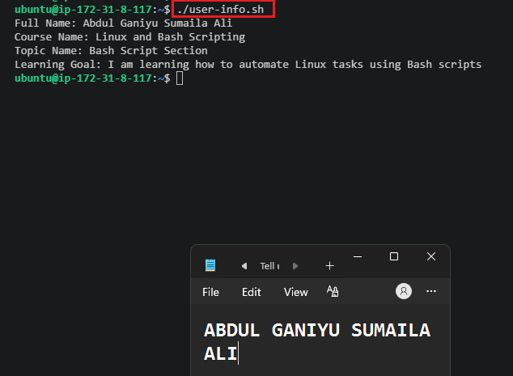

---

### Notes

Answer the following in your own words:

**1. What is a variable in Bash?**

A variable in Bash is a named container used to store data that can be reused throughout a script. Instead of typing the same value multiple times, you can store it in a variable and reference it whenever needed. Variables make scripts easier to read, update, and maintain.

---

**2. Why should we avoid spaces around the `=` sign when creating variables?**

Bash requires variable assignments to be written without spaces around the = sign. If spaces are added, Bash interprets the variable name and value as separate commands or arguments, which results in an error. For example, name=Abdul is correct, while name = Abdul is not.

---

**3. How do you access the value stored inside a Bash variable?**

To access the value of a variable, place a dollar sign ($) before the variable name. For example, if a variable is defined as name="Abdul", you can display its value using echo $name. The $ tells Bash to substitute the variable name with the value stored inside it.
---

# Task 4 — Arrays & Loops: Tools Checklist Script

## Goal

Use arrays and loops to print a checklist of tools used in Bash scripting.

### Evidence

#### Screenshot 1 — Content of `tools-checklist.sh`

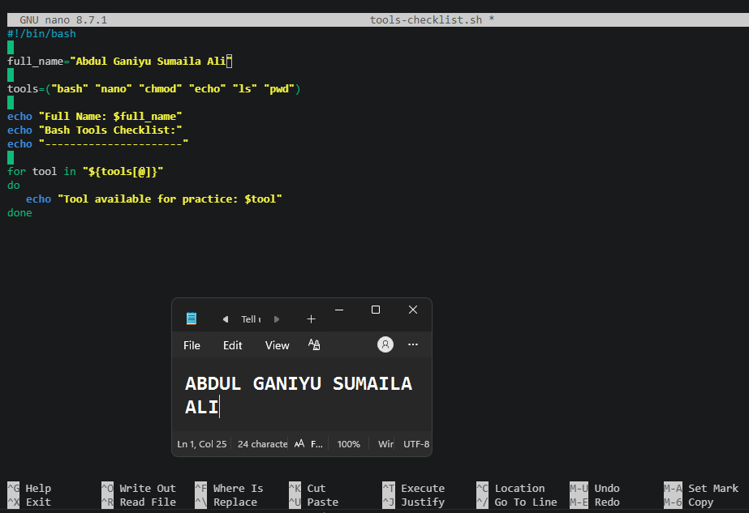

---

#### Screenshot 2 — Output of `./tools-checklist.sh`

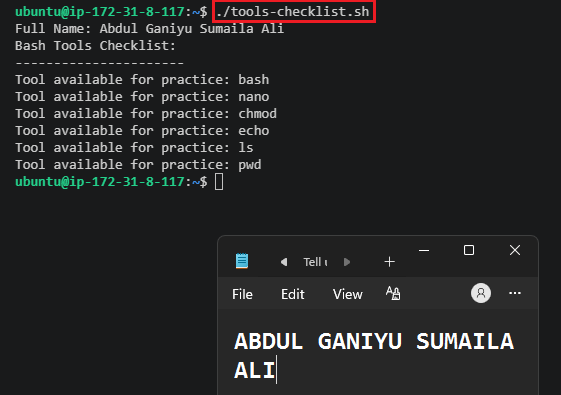

---

### Notes

Answer the following in your own words:

**1. What is an array in Bash?**

An array in Bash is a variable that can store multiple values under a single name. Instead of creating separate variables for related data, you can keep them together in one array and access each item by its position. This makes it easier to organize and manage collections of data in a script.

---

**2. Why are arrays useful in scripts?**

Arrays are useful because they allow you to work with multiple related values efficiently. For example, you can store a list of server names, tools, or files in one variable and process them using loops. This reduces repetitive code and makes scripts easier to update and maintain.

---

**3. What does `"${tools[@]}"` mean?**

"${tools[@]}" refers to all the elements stored in the array named tools. When used in a loop, it expands each array item individually so that Bash can process them one by one. This is a common way to iterate through every value in an array.

---

**4. What is the purpose of the `for` loop in this script?**

The purpose of the for loop is to repeat a set of commands for each item in the array. Instead of writing the same command multiple times, the loop automatically goes through each element one by one and performs the required action. This makes scripts more efficient, scalable, and easier to read.
---

# Task 5 — Loops: Number Counter Script

## Goal

Use loops to repeat a task multiple times.

### Evidence

#### Screenshot 1 — Content of `counter.sh`

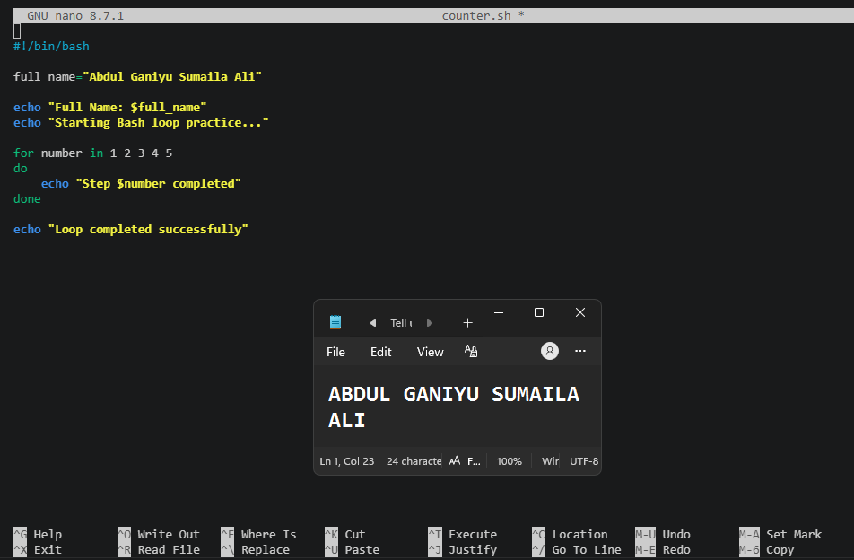

---

#### Screenshot 2 — Output of `./counter.sh`

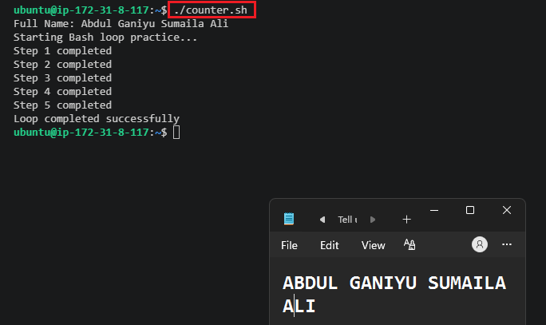

---

### Notes

Answer the following in your own words:

**1. What is a loop?**

A loop is a programming structure that repeats a set of commands multiple times. Instead of writing the same code repeatedly, a loop allows the script to perform the same task automatically until a condition is met or all items have been processed.

---

**2. Why do we use loops in Bash scripting?**

Loops help automate repetitive tasks and make scripts shorter and more efficient. They are useful when working with multiple files, servers, users, or any situation where the same action needs to be performed several times. This saves time and reduces the chance of mistakes.

---

**3. How many times did the loop run in your script?**

The loop ran 5 times because it processed each number in the list 1 2 3 4 5. During each iteration, it printed a message showing that the corresponding step had been completed.

---

**4. What would you change if you wanted the loop to run 10 times?**

I would update the list of numbers in the for loop so it includes numbers from 1 to 10 instead of 1 to 5. For example:

for number in 1 2 3 4 5 6 7 8 9 10
do
    echo "Step $number completed"
done

This would make the loop run 10 times, printing a message for each step from 1 to 10.

---

# Task 6 — Files & Conditionals: File Validation Script

## Goal

Use file checks and conditionals to verify whether files and directories exist.

### Evidence

#### Screenshot 1 — Output of `ls -lah ../test-folder`

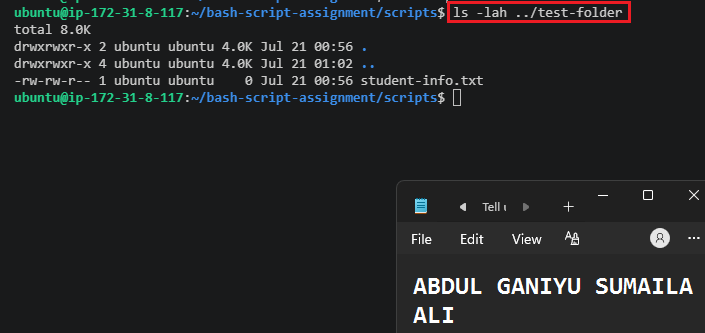

---

#### Screenshot 2 — Content of `file-check.sh`

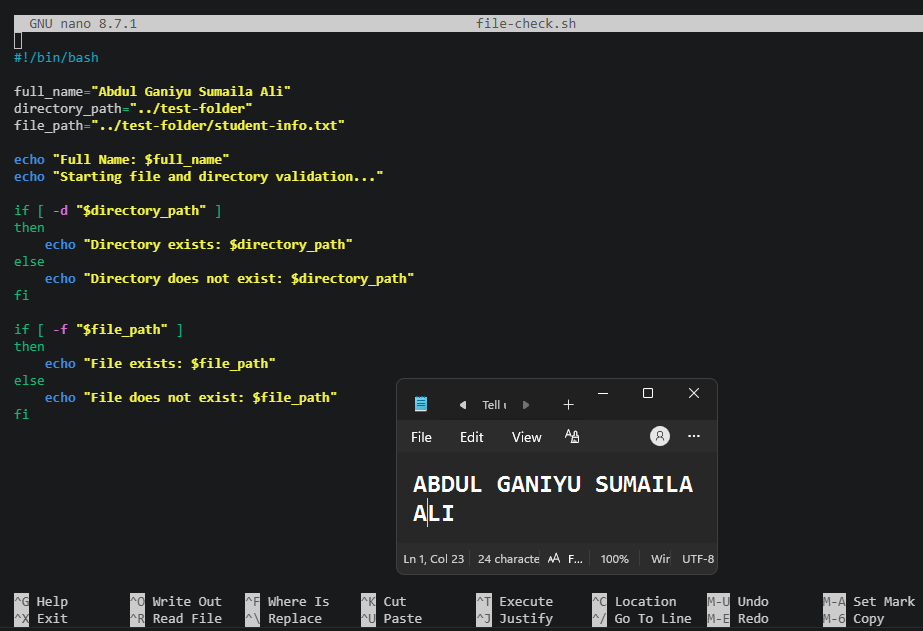

---

#### Screenshot 3 — Output of `./file-check.sh`

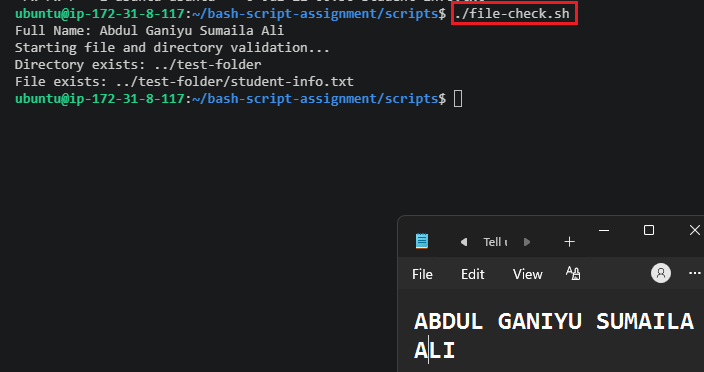

---

### Notes

Answer the following in your own words:

**1. What does `-d` check in Bash?**

The -d test checks whether a specified path exists and is a directory. It returns true if the directory exists and false if it does not. This is commonly used in scripts to verify that a folder is present before performing operations on it.

---

**2. What does `-f` check in Bash?**

The -f test checks whether a specified path exists and is a regular file. It returns true if the file exists and false if it does not. This helps prevent errors when a script needs to read from or work with a specific file.

---

**3. Why should file and directory paths be stored in variables?**

Storing file and directory paths in variables makes scripts easier to read, maintain, and update. If a path changes, you only need to update it in one place instead of searching through the entire script. It also reduces typing mistakes and makes the script more reusable.

---

**4. What happens if the file does not exist?**

If the file does not exist, a check using -f will return false and the script can follow an alternative path, such as displaying an error message or skipping that operation. This prevents the script from failing unexpectedly and helps handle missing files more safely.

---

# Task 7 — Conditionals: Pass or Retry Script

## Goal

Use if-else conditionals to make decisions based on a variable value.

### Evidence

#### Screenshot 1 — Content of `score-check.sh` with `score=85`

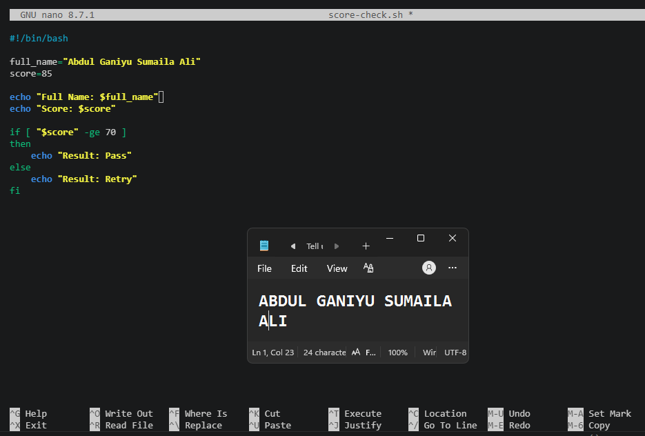

---

#### Screenshot 2 — Output showing `Result: Pass`

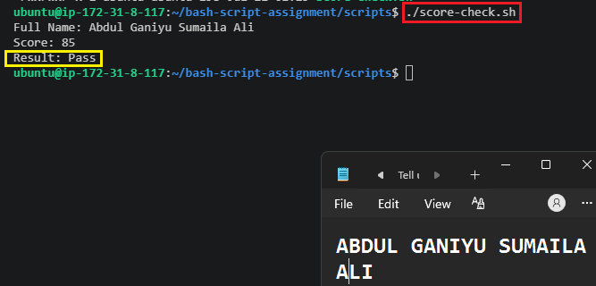

---

#### Screenshot 3 — Content of `score-check.sh` with `score=55`

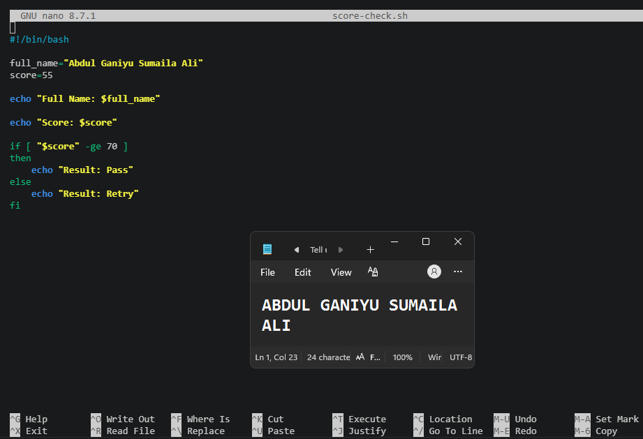

---

#### Screenshot 4 — Output showing `Result: Retry`

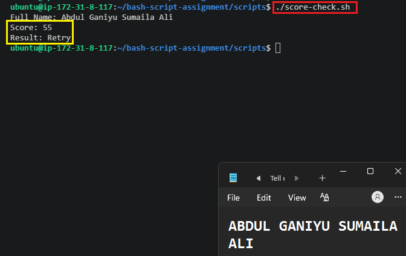

---

### Notes

Answer the following in your own words:

**1. What is the purpose of if-else in Bash?**

The if-else statement allows a script to make decisions based on conditions. It checks whether a condition is true or false and then executes different commands depending on the result. This helps scripts handle different situations automatically instead of following a single fixed path.

---

**2. What does `-ge` mean?**

-ge stands for greater than or equal to. It is used to compare two numeric values in Bash. For example, [ "$score" -ge 70 ] checks whether the value of score is 70 or higher.

---

**3. Why should conditions be tested with different values?**

Conditions should be tested with different values to make sure the script behaves correctly in all scenarios. Testing both expected and unexpected inputs helps identify mistakes, confirms that the logic works as intended, and reduces the risk of errors when the script is used in real situations.

---

**4. How can conditionals help in automation scripts?**

Conditionals allow automation scripts to make decisions based on system states, user input, or command results. For example, a script can check whether a file exists before processing it, verify that a service is running before restarting it, or create a backup only when certain conditions are met. This makes automation more reliable, flexible, and intelligent.

---

# Task 8 — Functions: Final Bash Automation Script

## Goal

Create a final Bash script using functions to organize reusable code.

### Evidence

#### Screenshot 1 — Content of `final-automation.sh`

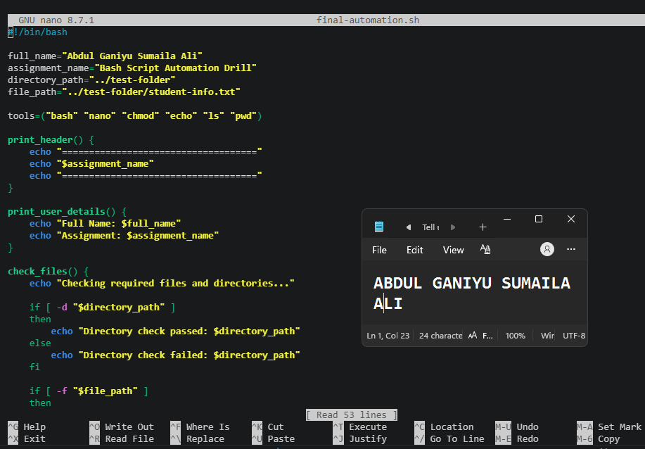

---

#### Screenshot 2 — Output of `./final-automation.sh`

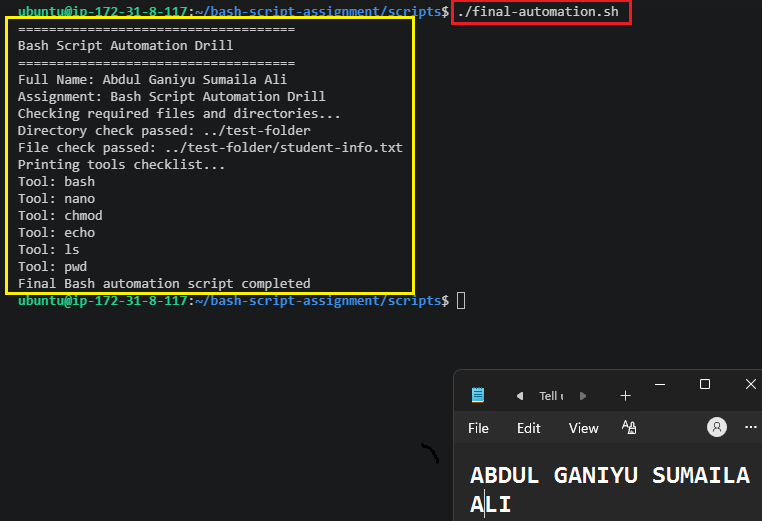

---

#### Screenshot 3 — Output of `ls -lah` showing all created scripts

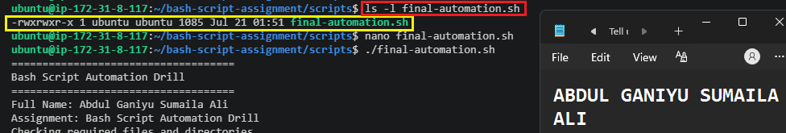

---

### Notes

Answer the following in your own words:

**1. What is a function in Bash?**

A function is a reusable block of commands that performs a specific task inside a script. Instead of writing the same commands multiple times, you can place them inside a function and call the function whenever you need it. This helps keep scripts organized and easier to manage.

---

**2. Why are functions useful in scripts?**

Functions make scripts cleaner and more structured by breaking large tasks into smaller sections. They also reduce repetition because the same logic can be reused whenever needed. During this assignment, I found that functions made the final script much easier to read and troubleshoot since each function had a specific responsibility.

---

**3. Which functions did you create in this script?**

In my script, I created four functions:

print_header() to display the assignment heading.
print_user_details() to show my name and assignment details.
check_files() to verify that the required directory and file existed.
print_tools() to loop through the tools array and display each tool.

Each function handled a separate part of the script, making the overall workflow easier to follow.

---

**4. How does this final script combine variables, arrays, loops, conditionals, files, and functions?**

This script brings together everything learned throughout the assignment. Variables store information such as my name, assignment details, and file paths. An array stores the list of Bash tools, while a for loop goes through the array and prints each item. Conditional statements use -d and -f to check whether the required directory and file exist. All of these tasks are grouped into functions, which are then called in sequence to create a complete automation workflow. It was a good example of how different Bash concepts work together to solve a real task.

---

# LinkedIn Post (Required)

## Evidence

#### LinkedIn Post URL

Paste your LinkedIn post URL here:

`https://www.linkedin.com/posts/abdulganiyu0_dmibypravinmishra-devops-linux-ugcPost-7485160668401283072-J4a7/?utm_source=share&utm_medium=member_desktop&rcm=ACoAAFamVAYBbC0P-4_t5y56JbVGUfZFmuyqJnY`

---

#### Screenshot — Published LinkedIn post

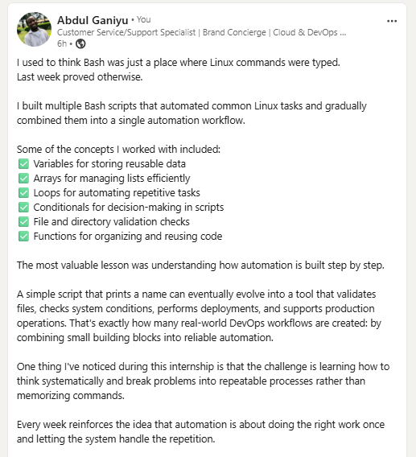 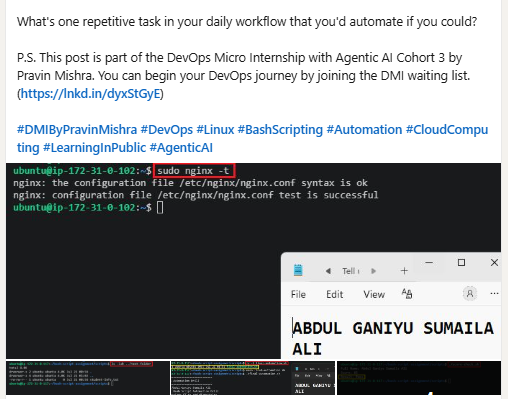 

---

# Submission Instructions

- Add all required screenshots in your submission
- Full name must be visible in required screenshots
- All script files must be created and run successfully
- Required notes must be answered clearly for every task
- Do not expose sensitive information (keys, passwords, credentials)

---

# Completion Checklist

- [✅] Task 1: Environment setup verified, workspace created (Screenshots 1–2, Notes answered)
- [✅] Task 2: First script created, executed, permissions verified (Screenshots 1–3, Notes answered)
- [✅] Task 3: Variables script created and run (Screenshots 1–2, Notes answered)
- [✅] Task 4: Arrays and loops script created and run (Screenshots 1–2, Notes answered)
- [✅] Task 5: Counter loop script created and run (Screenshots 1–2, Notes answered)
- [✅] Task 6: File validation script created and run (Screenshots 1–3, Notes answered)
- [✅] Task 7: Pass/Retry conditional script tested with both values (Screenshots 1–4, Notes answered)
- [✅] Task 8: Final automation script created and run (Screenshots 1–3, Notes answered)
- [✅] All scripts run without errors
- [✅] Full Name visible in all required screenshots
- [✅] LinkedIn post published and URL submitted
- [✅] No sensitive data exposed

---

## 📌 About DMI & CloudAdvisory

DevOps Micro Internship (DMI) is a project-based DevOps program run by Pravin Mishra (The CloudAdvisory) focused on real-world execution, systems thinking, and career readiness.

It helps learners build strong DevOps foundations with hands-on experience.

---

## 📌 Resources

- 🌐 DMI Official Website: https://pravinmishra.com/dmi  
- 🎓 DevOps for Beginners (Udemy): https://www.udemy.com/course/devops-for-beginners-docker-k8s-cloud-cicd-4-projects/  
- 🎓 Agentic AI DevOps with Claude Code: https://www.udemy.com/course/ultimate-agentic-ai-devops-with-claude-code/  
- 🎓 DevOps with Claude Code: Terraform, EKS, ArgoCD & Helm: https://www.udemy.com/course/devops-with-claude-code-terraform-eks-argocd-helm/  
- ▶️ YouTube Playlist: https://www.youtube.com/playlist?list=PLFeSNDtI4Cho  
- 🔗 Pravin Mishra (LinkedIn): https://www.linkedin.com/in/pravin-mishra-aws-trainer/  
- 🏢 CloudAdvisory (LinkedIn): https://www.linkedin.com/company/thecloudadvisory/

---

*This submission is part of DevOps Micro Internship (DMI) Cohort 3 — Agentic AI Track.*