# Assignment 6 — Build an AI-Assisted Linux Health Check (AI-Assisted Linux Incident Triage)

Part of the DevOps Micro Internship (DMI) Cohort 3 with Agentic AI

---

## Purpose

In this assignment, you will build a read-only Bash triage script that checks the health of your Ubuntu server and Nginx application, connect it to Claude Code as a reusable `/linux-triage` skill, simulate a controlled Nginx incident, use the skill to gather and analyze evidence, recover the service manually, and verify recovery. The workflow follows the Agentic Loop: Gather → Analyze → Human Act → Verify.

---

# Task 1 — Confirm the Healthy Baseline and Create the Workspace

## Goal

Confirm that Nginx and the React application are healthy before building the automation.

### Evidence

#### Screenshot 1 — Output of `systemctl is-active nginx`, `ss -ltn | grep ':80'`, and `curl -I http://localhost`

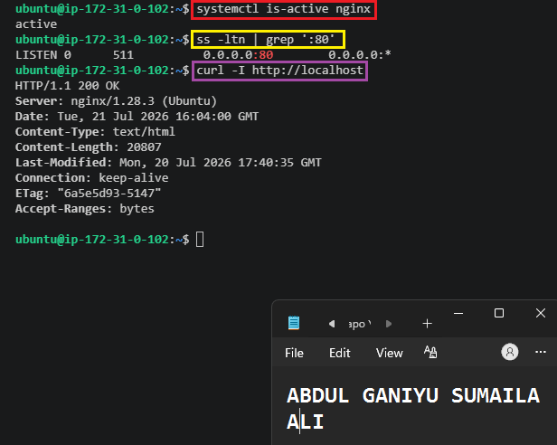

---

#### Screenshot 2 — Output of `pwd` and `find . -maxdepth 4 -type d | sort` showing the workspace folder structure

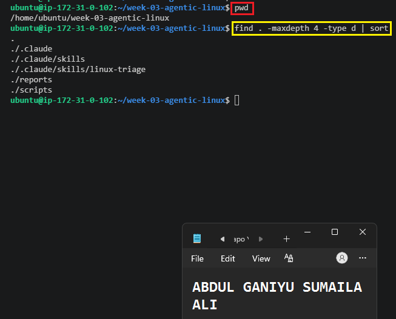

---

### Notes

Answer the following in your own words:

**1. What proves that Nginx is running?**

The command systemctl is-active nginx returned active, which confirms that the Nginx service is currently running on the server. I also verified it by sending a request with curl -I http://localhost and receiving a 200 OK response, showing that Nginx was successfully handling requests.

---

**2. What proves that the server is listening for HTTP traffic?**

The command ss -ltn | grep ':80' showed that port 80 was in a listening state. Since port 80 is the default HTTP port, this confirms that the server is actively waiting for and accepting incoming web traffic.

---

**3. Why must you capture a healthy baseline before simulating an incident?**

Capturing a healthy baseline gives you a known good state to compare against when something breaks. It helps identify whether an issue was caused by the simulated incident or if it already existed beforehand. In a real production environment, having baseline information makes troubleshooting faster and reduces the risk of misdiagnosing problems.

---

# Task 2 — Create Project Context and Safety Rules in CLAUDE.md

## Goal

Tell Claude exactly what this project does and what it is not allowed to do.

### Evidence

#### Screenshot 3 — CLAUDE.md open in VS Code showing all four sections (Project Overview, Incident Workflow, Safety Rules, Output Rules)

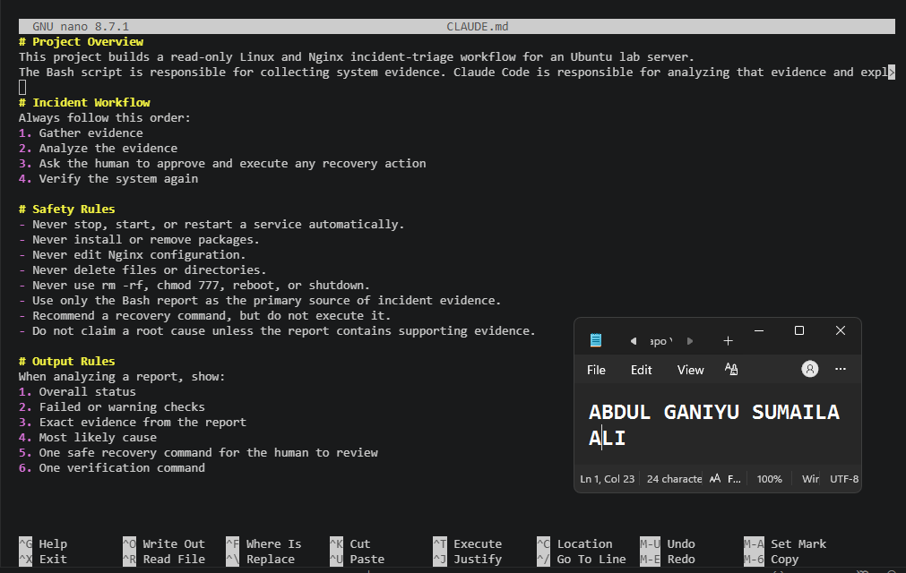

---

### Notes

Answer the following in your own words:

**1. Why should Claude receive project-specific operational rules?**

Project-specific operational rules help Claude understand the environment it is working in and the boundaries it must follow. Without those rules, it could make recommendations that don't align with the project's goals or safety requirements. In this assignment, the rules ensure that Claude focuses on analyzing evidence and suggesting safe next steps rather than making changes to the server.
---

**2. Why is the human required to execute the recovery command?**

The human remains responsible for any changes made to the system because recovery actions can have unintended consequences. By requiring human approval and execution, there is an opportunity to review the recommendation, verify that it is appropriate, and avoid making accidental changes that could worsen the situation.

---

**3. Which rule prevents Claude from making an unsupported diagnosis?**

The rule that prevents unsupported diagnoses is:

"Do not claim a root cause unless the report contains supporting evidence."

This rule ensures that conclusions are based on facts collected in the report rather than assumptions. It encourages evidence-based troubleshooting and reduces the risk of misidentifying the actual cause of an incident.

---

# Task 3 — Use Agentic AI to Plan Before Writing the Script

## Goal

Use Claude Code to inspect the environment and produce a read-only plan before creating any Bash code.

### Evidence

#### Screenshot 4 — Claude Code showing the five-check plan and read-only inspection results

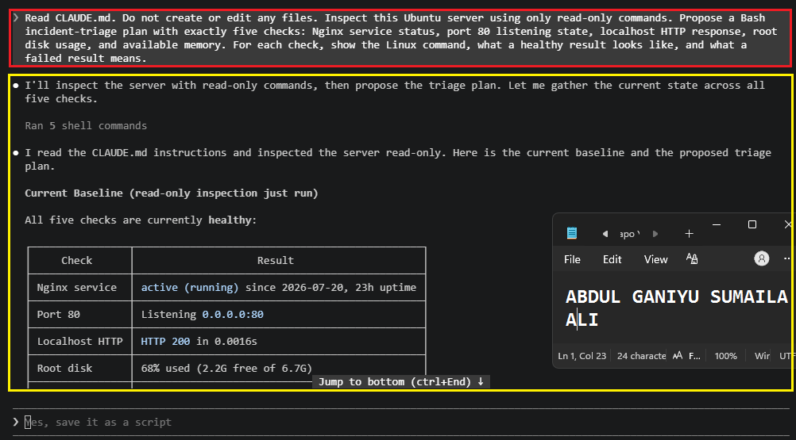 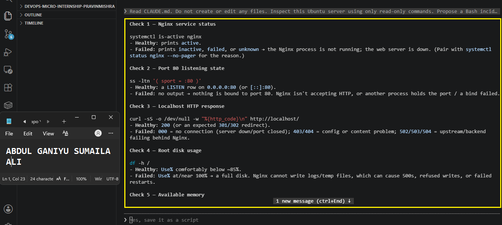 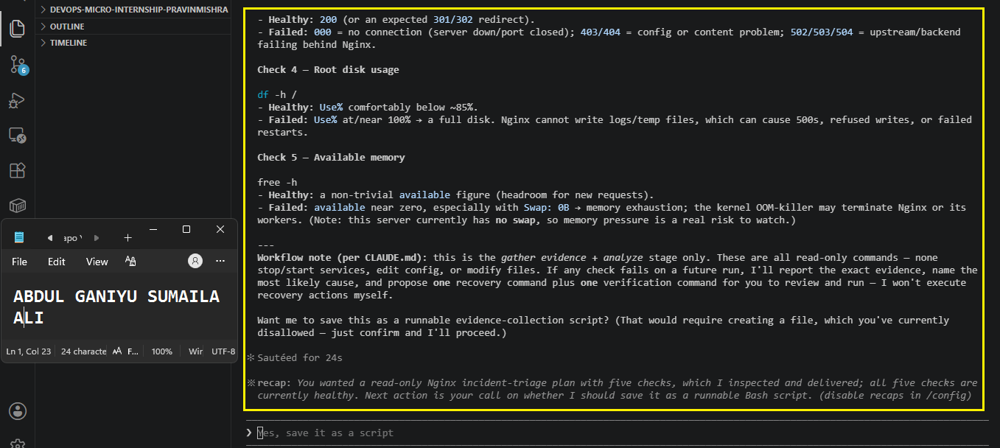

---

### Notes

Answer the following in your own words:

**1. Which part of this task represents the Gather phase?**

The Gather phase is when Claude inspected the server using only read-only commands to collect information about the system. Instead of making changes, it checked the Nginx service, port 80, the HTTP response from localhost, disk usage, and available memory. This provided the evidence needed before any analysis or recovery decisions.

---

**2. Did Claude follow the instruction not to create files? How did you verify this?**

Yes. Claude followed the instruction not to create any files. After exiting Claude Code, I ran find . -maxdepth 4 -type f | sort to list all the files in the project directory. The output only showed the existing files, such as CLAUDE.md, and there was no Bash script in the scripts folder, confirming that nothing new had been created.

---

**3. Why is planning before coding useful in DevOps automation?**

Planning before writing code helps ensure the script has a clear purpose and follows a logical workflow. It also reduces mistakes by identifying exactly what needs to be checked before implementation begins. In DevOps, this approach leads to more reliable automation because the script is designed around defined requirements instead of being built through trial and error.

---

# Task 4 — Build the Linux Triage Bash Script

## Goal

Create one Bash script that gathers consistent Linux and Nginx health evidence.

### Evidence

#### Screenshot 5 — Top section of `linux-triage.sh` showing variables, thresholds, and the checks array

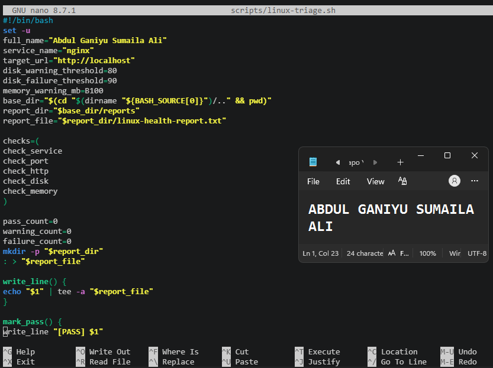

---

#### Screenshot 6 — Middle section showing check functions and conditionals

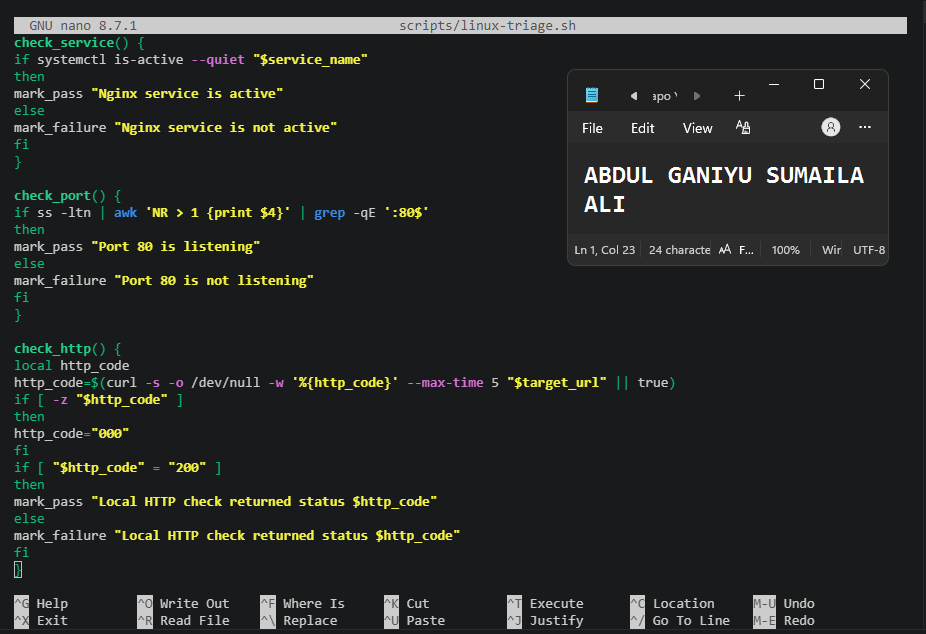 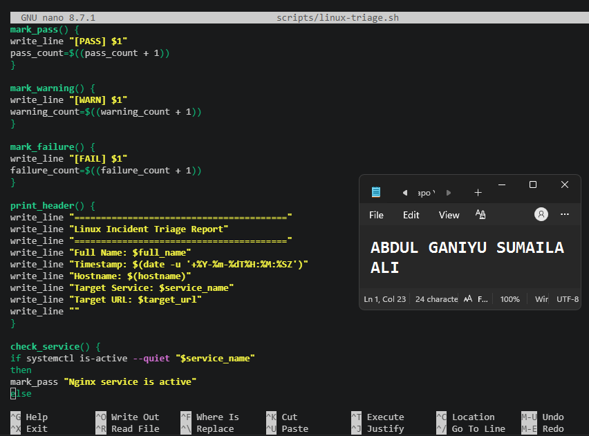

---

#### Screenshot 7 — Bottom section showing the loop, summary function, and exit behavior

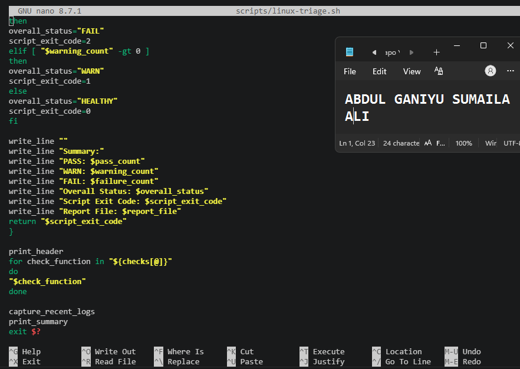

---

#### Screenshot 8 — Output of `bash -n scripts/linux-triage.sh` (no syntax errors) and `ls -l scripts/linux-triage.sh` showing executable permission

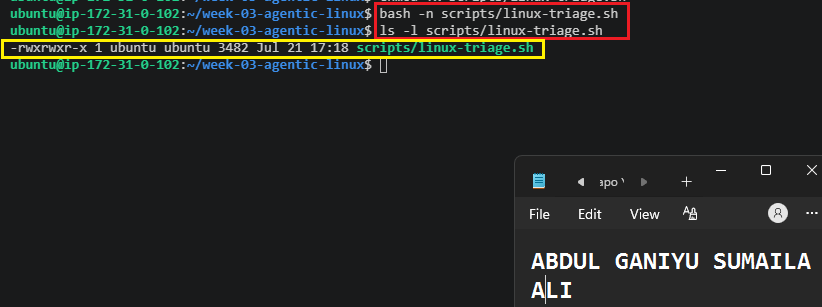

---

### Notes

Answer the following in your own words:

**1. What is stored in the checks array?**

The checks array stores the names of the five health-check functions: check_service, check_port, check_http, check_disk, and check_memory. Instead of listing the commands directly, it keeps the functions in one place so the script knows exactly which checks to run.

---

**2. How does the `for` loop use that array?**

The for loop goes through each function name stored in the checks array one at a time. During each iteration, it calls the current function, allowing every health check to run automatically without writing each function call separately.

---

**3. Why are the health checks separated into functions?**

Separating the health checks into functions makes the script easier to read, maintain, and troubleshoot. Each function has a single responsibility, so if I need to update or fix one check in the future, I can do it without affecting the rest of the script. It also makes adding new health checks much simpler.

---

**4. What is the purpose of `$(...)` in this script?**

$(...) is used for command substitution. It runs a command and stores its output so the script can use it later. For example, the script uses $(hostname) to capture the server's hostname and $(date ...) to record the current timestamp in the health report.

---

**5. Why does the script use different exit codes for HEALTHY, WARN, and FAIL?**

Different exit codes allow the script to clearly communicate its final status to other programs or automation tools. An exit code of 0 means all checks passed, 1 indicates there are warnings that may need attention, and 2 signals a failure that requires immediate investigation. This makes it easier for monitoring or CI/CD systems to respond appropriately based on the script's result.

---

# Task 5 — Run and Understand the Healthy-State Report

## Goal

Run the Bash script against the healthy server and verify that it creates a report.

### Evidence

#### Screenshot 9 — Output of `./scripts/linux-triage.sh` showing your Full Name and all five check results

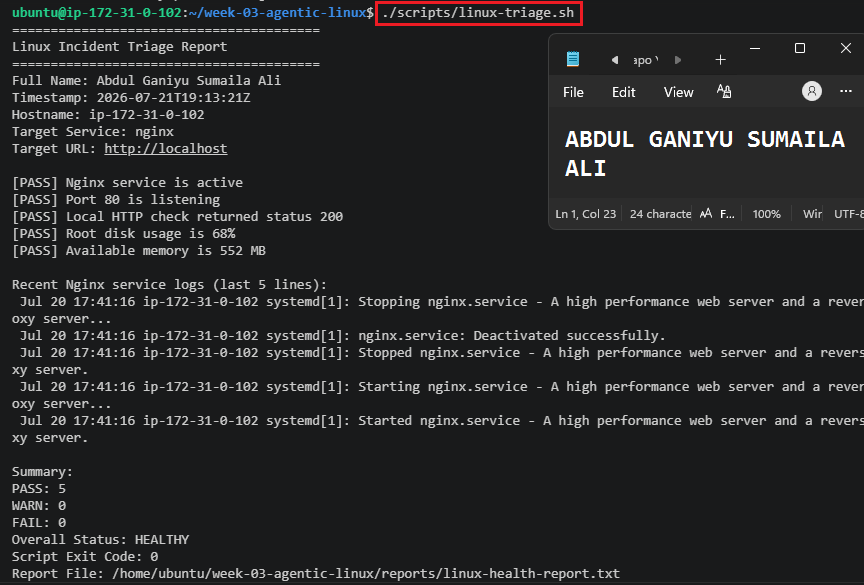

---

#### Screenshot 10 — Output showing the captured exit code and final summary

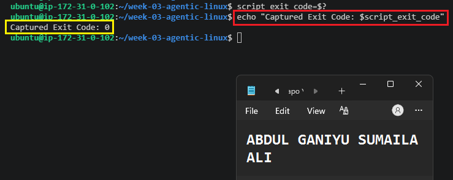

---

### Notes

Answer the following in your own words:

**1. What is the overall status of your healthy baseline?**

The overall status of my healthy baseline was HEALTHY. All five health checks passed successfully, with no warnings or failures. This confirmed that Nginx was running correctly, the application was responding as expected, and the server's disk and memory usage were within acceptable limits.

---

**2. Which exact Linux evidence proves the application is serving traffic?**

The strongest evidence is the line:

[PASS] Local HTTP check returned status 200

This shows that the curl request to http://localhost received an HTTP 200 OK response, confirming that Nginx was successfully serving the application. The report also showed that the Nginx service was active and port 80 was listening, which further confirmed that the web server was operating normally.

---

**3. Did your script return exit code 0 or 1? Explain why.**

My script returned exit code 0 because every health check passed. There were 5 PASS results, 0 warnings, and 0 failures, so the script classified the server as HEALTHY and returned the success exit code.

---

**4. What is the difference between a warning and a failure in this script?**

A warning means something needs attention but the system is still functioning. For example, if disk usage exceeds the warning threshold or available memory becomes low, the script marks it as WARN. A failure, on the other hand, indicates a critical problem that affects the application's availability, such as Nginx not running, port 80 not listening, or the HTTP health check failing. Failures require immediate investigation because they usually mean the service is not working as expected.

---

# Task 6 — Create and Run the /linux-triage Skill

## Goal

Turn the Bash script into a reusable, manually invoked Agentic AI workflow.

### Evidence

#### Screenshot 11 — `SKILL.md` showing the frontmatter, allowed tool restrictions, and safety rules

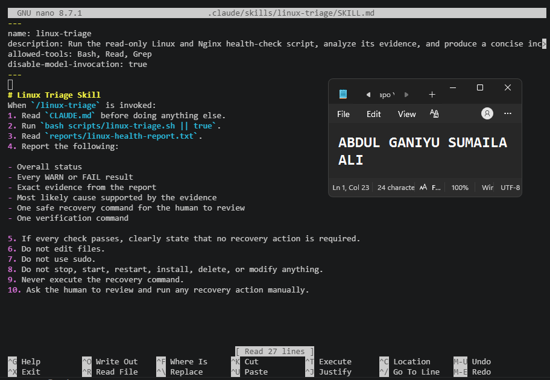.png)
Screenshot-11-SKILL.md-content
---

#### Screenshot 12 — `/linux-triage` output for the healthy server

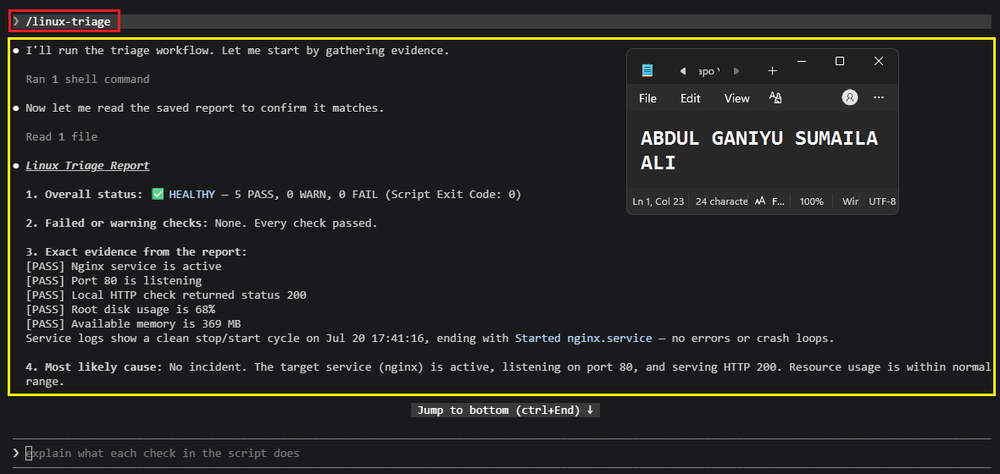 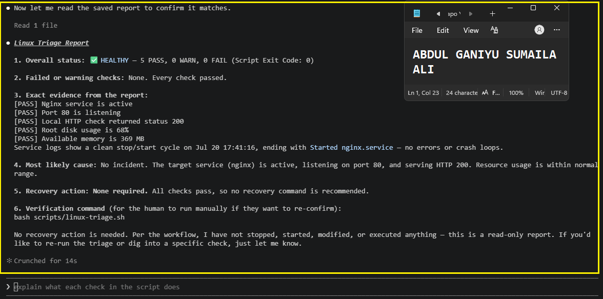

---

### Notes

Answer the following in your own words:

**1. Why does this skill have Bash, Read, and Grep, but not Write?**

The skill is designed to safely inspect and analyze the server without making any changes. Bash is used to run the read-only health-check script, Read is used to open and review the generated report, and Grep can search for specific information if needed. Write is intentionally excluded so the skill cannot create, edit, or delete files, helping prevent accidental changes to the server.

---

**2. Why is `disable-model-invocation: true` useful for this skill?**

disable-model-invocation: true ensures the skill follows the predefined workflow instead of generating its own actions or decisions. This makes the behavior more predictable, keeps it focused on the approved Bash script and report, and reduces the risk of the AI performing actions outside the defined safety rules.

---

**3. What part is performed by Bash, and what part is performed by Claude?**

Bash performs the actual system checks, such as verifying the Nginx service, checking whether port 80 is listening, testing the HTTP response, and collecting disk and memory information into a report. Claude then reads that report, analyzes the evidence, explains the server's health status, identifies any warnings or failures, and recommends safe recovery and verification commands without making changes to the server.

---

**4. Why is this better than asking Claude "Is my server healthy?" without giving it evidence?**

This approach is more reliable because Claude bases its conclusions on real data collected from the server instead of making assumptions. The Bash script gathers objective evidence, such as service status, HTTP response, disk usage, and memory availability, and Claude uses that evidence to produce an accurate analysis. This evidence-based workflow reduces the chance of incorrect conclusions and follows good DevOps incident-triage practices.

---

# Task 7 — Simulate an Nginx Incident and Let the Skill Diagnose It

## Goal

Create a controlled service failure, gather evidence through Bash, and let Claude analyze the evidence without taking recovery action.

### Evidence

#### Screenshot 13 — Output showing Nginx is inactive and the HTTP request fails

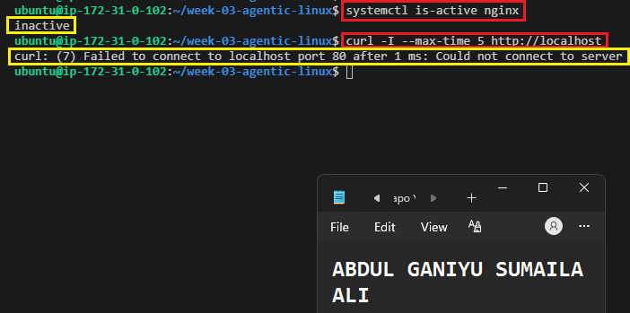

---

#### Screenshot 14 — `/linux-triage` output showing failed evidence, most likely cause, and a suggested recovery command

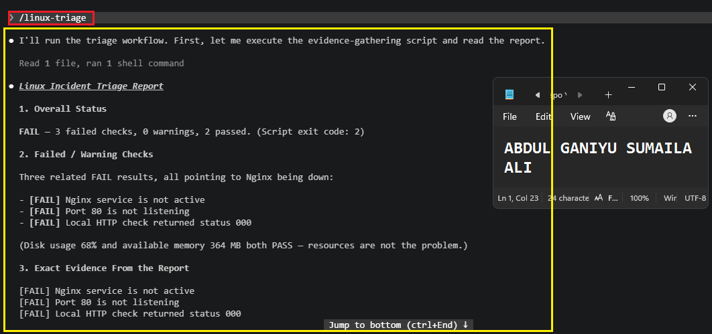 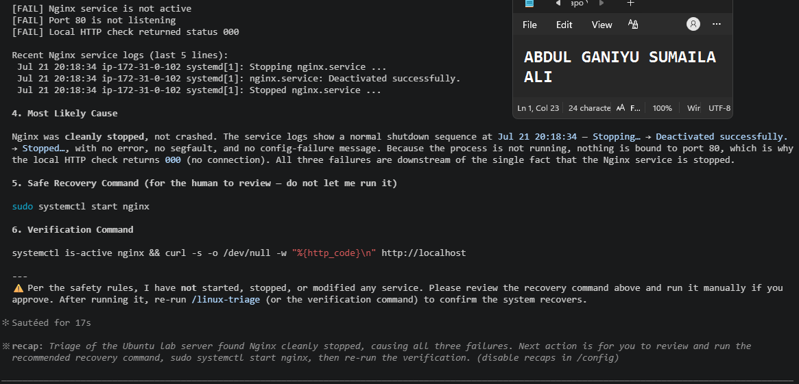

---

#### Screenshot 15 — `incident-failure-report.txt` showing the failed checks and your Full Name

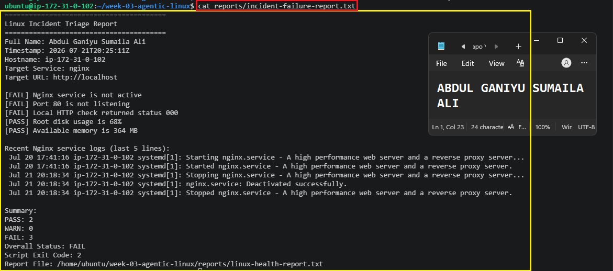

---

### Notes

Answer the following in your own words:

**1. Which three checks failed?**

The three failed checks were the Nginx service status check, the port 80 listening check, and the local HTTP response check. The report showed that Nginx was not active, port 80 was not listening, and the HTTP request to localhost returned status 000.
---

**2. What evidence supports the conclusion that Nginx is unavailable?**

The report provided several pieces of evidence. It showed "[FAIL] Nginx service is not active", "[FAIL] Port 80 is not listening", and "[FAIL] Local HTTP check returned status 000". The Nginx logs also showed that the service had been stopped successfully. Together, these results confirm that Nginx was not running and therefore could not serve web traffic.

---

**3. Did Claude execute the recovery command? Why is that important?**

The report provided several pieces of evidence. It showed "[FAIL] Nginx service is not active", "[FAIL] Port 80 is not listening", and "[FAIL] Local HTTP check returned status 000". The Nginx logs also showed that the service had been stopped successfully. Together, these results confirm that Nginx was not running and therefore could not serve web traffic.

---

**4. Which phase of the Agentic Loop is represented by the Bash report?**

The Bash report represents the Gather Evidence phase of the Agentic Loop. It collects factual information about the server's condition, including service status, port availability, HTTP responses, disk usage, memory usage, and recent logs.

---

**5. Which phase is represented by Claude's explanation?**

Claude's explanation represents the Analyze the Evidence phase of the Agentic Loop. Claude reviews the information collected in the report, identifies the failed checks, determines the most likely cause of the incident, and recommends a safe recovery action without making any changes itself.

---

# Task 8 — Recover Manually, Verify Again, and Write the Incident Summary

## Goal

Recover the service as the human operator and prove that the system is healthy again.

### Evidence

#### Screenshot 16 — Output showing Nginx is active and `curl -I http://localhost` returns 200 OK

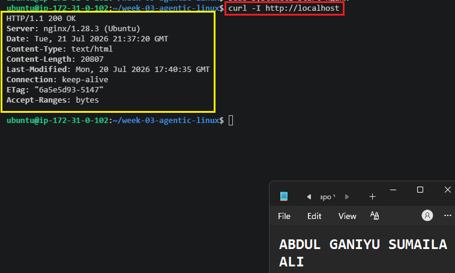

---

#### Screenshot 17 — Second `/linux-triage` output showing successful recovery with no FAIL results

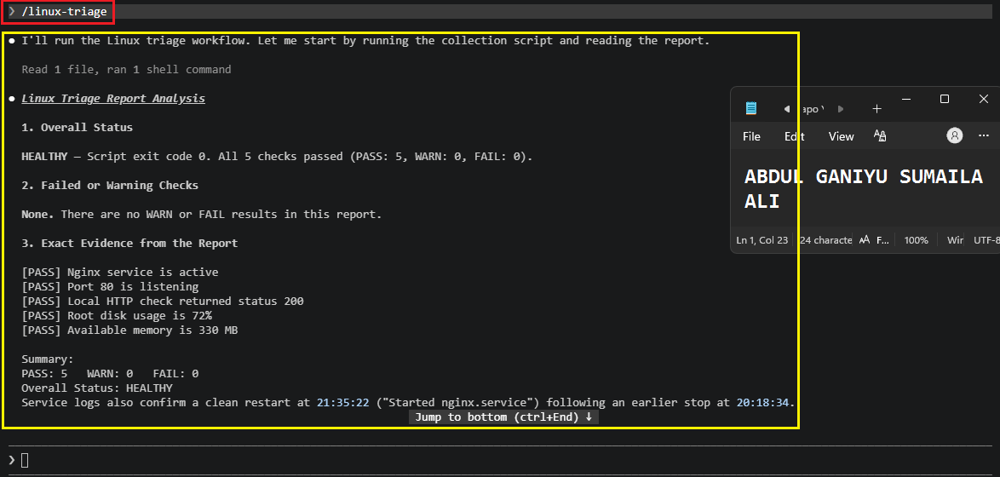 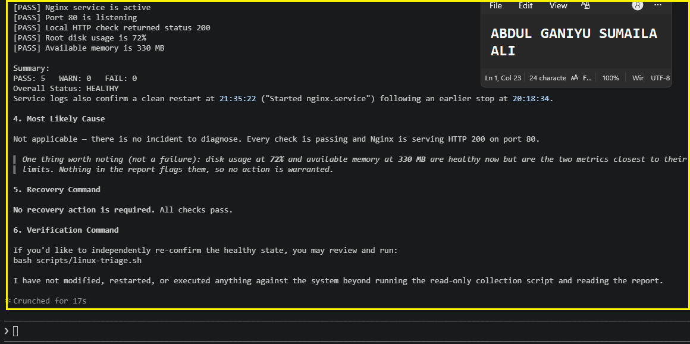

---

#### Screenshot 18 — Output of `ls -lah reports` showing both `incident-failure-report.txt` and `recovery-report.txt`

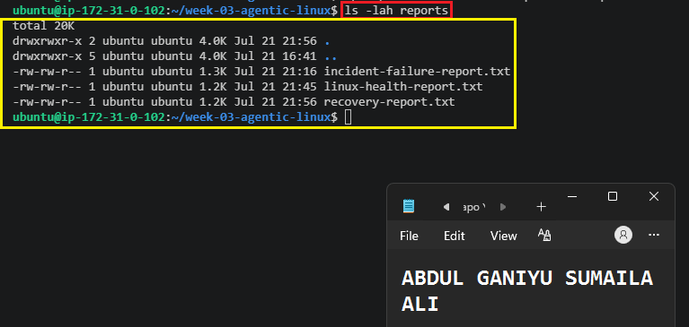
---

#### Screenshot 19 — `incident-summary.md` showing all required sections and your Full Name

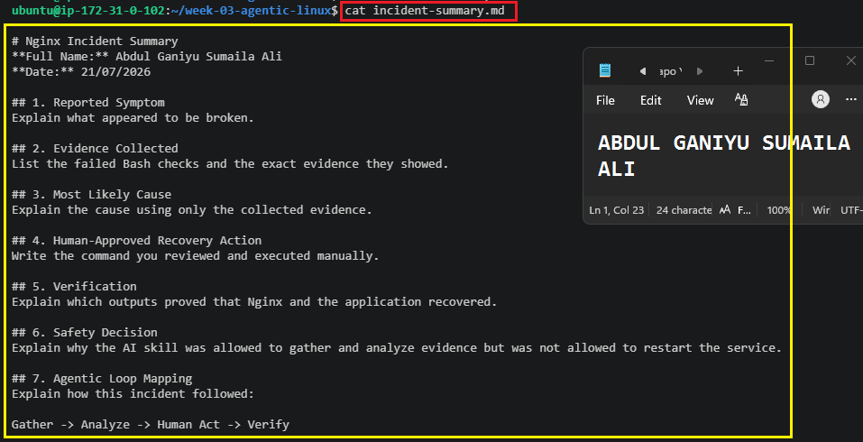

---

### Notes

Answer the following in your own words:

**1. What action did you execute manually?**

sudo systemctl start nginx

---

**2. What evidence proves that the service recovered?**

The service recovery was confirmed by several pieces of evidence:

systemctl is-active nginx returned active.
curl -I http://localhost returned HTTP/1.1 200 OK.
The second /linux-triage run showed:
[PASS] Nginx service is active
[PASS] Port 80 is listening
[PASS] Local HTTP check returned status 200
The final report showed Overall Status: HEALTHY with no failed checks.

---

**3. Why is the second triage run necessary?**

The second triage run verifies that the recovery action actually fixed the problem. Without running the checks again, we would only assume the service recovered instead of confirming it with real evidence.

---

**4. What could go wrong if an AI agent automatically restarted every failed service?**

Automatically restarting services could hide the real root cause, interrupt users, cause data loss, create service loops, or make an existing problem worse. Some failures require investigation first, which is why human approval is important before taking corrective action.

---

**5. In one sentence, explain the difference between using AI as a chatbot and using AI in this agentic workflow.**

A chatbot mainly answers questions, while an agentic AI workflow follows a structured process to gather evidence, analyze results, recommend actions, and assist humans in making informed operational decisions.
---

# Incident Summary

Fill in all seven sections below in your own words.

**Full Name:** Abdul Ganiyu Sumaila Ali

**Date:** 21/07/2026

---

**1. Reported Symptom**

The web application became unavailable after Nginx was intentionally stopped as part of the incident simulation. The website could no longer respond to HTTP requests, and users would have been unable to access the application.

---

**2. Evidence Collected**

The Bash triage report identified three failed checks:

[FAIL] Nginx service is not active
[FAIL] Port 80 is not listening
[FAIL] Local HTTP check returned status 000

The Nginx logs also showed that the service had been stopped successfully, confirming that it was no longer running.

---

**3. Most Likely Cause**

Based on the collected evidence, the most likely cause was that the Nginx service had been stopped. Since Nginx was inactive, port 80 was not listening and the HTTP health check could not establish a connection, resulting in status code 000.

---

**4. Human-Approved Recovery Action**

After reviewing Claude's recommendation, I manually executed:

sudo systemctl start nginx

This restored the Nginx service and allowed the application to become available again.

---

**5. Verification**

Recovery was verified using multiple checks:

systemctl is-active nginx returned active.
curl -I http://localhost returned HTTP/1.1 200 OK.
The second triage report showed all health checks passing.
The final report returned Overall Status: HEALTHY and Script Exit Code: 0.

---

**6. Safety Decision**

The AI skill was allowed to gather evidence and analyze the report because those actions are safe and read-only. However, it was not allowed to restart Nginx because operational changes should always be reviewed and approved by a human to prevent unintended consequences and maintain accountability.

---

**7. Agentic Loop Mapping**

This incident followed the complete Agentic Loop:

Gather: The Bash script collected evidence about service status, port availability, HTTP responses, disk usage, memory usage, and logs.
Analyze: Claude reviewed the report and identified the stopped Nginx service as the root cause.
Human Act: I reviewed the recommendation and manually executed sudo systemctl start nginx.
Verify: The triage script was run again to confirm that all checks passed and the application had recovered.
---

# LinkedIn Post (Required)

## Evidence

#### LinkedIn Post URL

Paste your LinkedIn post URL here:

`https://www.linkedin.com/posts/abdulganiyu0_devops-linux-aws-ugcPost-7485492472052269056-Cg8e/?utm_source=share&utm_medium=member_desktop&rcm=ACoAAFamVAYBbC0P-4_t5y56JbVGUfZFmuyqJnY`

---

#### Screenshot — Published LinkedIn post

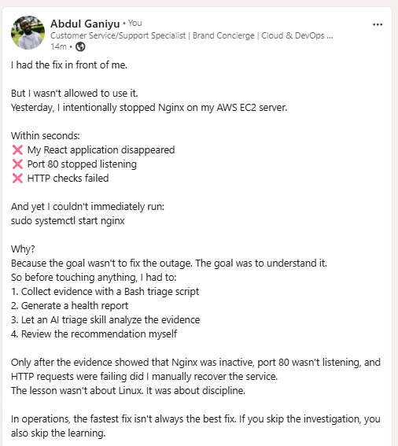 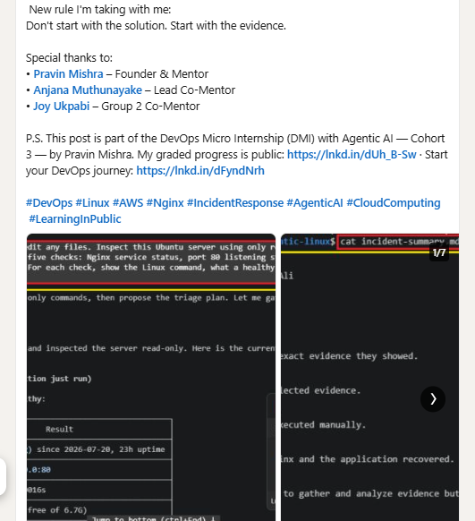

---

# GitHub Repository URL

Paste the URL of your GitHub folder or repository containing the assignment files here:

`https://github.com/G-abdul/Ultimate-Agentic-DevOps-with-Claude-Code.git`

---

# Submission Instructions

- Add all required screenshots in your submission
- Full Name must be visible in required screenshots and the Bash report
- All written answers must be in your own words
- Do not expose sensitive information (keys, passwords, AWS account IDs, tokens)
- GitHub URL must be included in this document

---

# Completion Checklist

- [✅] Task 1: Healthy baseline confirmed, workspace created (Screenshots 1–2, Notes answered)
- [✅] Task 2: CLAUDE.md created with all four sections (Screenshot 3, Notes answered)
- [✅] Task 3: Five-check plan produced by Claude using read-only tools (Screenshot 4, Notes answered)
- [✅] Task 4: `linux-triage.sh` created, syntax validated, executable permission set (Screenshots 5–8, Notes answered)
- [✅] Task 5: Healthy-state report generated with no FAIL result (Screenshots 9–10, Notes answered)
- [✅] Task 6: `/linux-triage` skill created and run successfully on healthy server (Screenshots 11–12, Notes answered)
- [✅] Task 7: Nginx incident simulated, failed evidence captured, Claude did not execute recovery (Screenshots 13–15, Notes answered)
- [✅] Task 8: Nginx recovered manually, recovery verified, reports saved, incident summary complete (Screenshots 16–19, Notes answered)
- [✅] Incident summary contains all seven required sections
- [✅] LinkedIn post published and URL submitted
- [✅] Full Name visible in all required screenshots and the Bash report
- [✅] Skill does not have Write permission
- [✅] Skill did not execute any recovery commands
- [✅] No sensitive data exposed

---

## 📌 About DMI & CloudAdvisory

DevOps Micro Internship (DMI) is a project-based DevOps program run by Pravin Mishra (The CloudAdvisory) focused on real-world execution, systems thinking, and career readiness.

It helps learners build strong DevOps foundations with hands-on experience.

---

## 📌 Resources

- 🌐 DMI Official Website: https://pravinmishra.com/dmi  
- 🎓 DevOps for Beginners (Udemy): https://www.udemy.com/course/devops-for-beginners-docker-k8s-cloud-cicd-4-projects/  
- 🎓 Agentic AI DevOps with Claude Code: https://www.udemy.com/course/ultimate-agentic-ai-devops-with-claude-code/  
- 🎓 DevOps with Claude Code: Terraform, EKS, ArgoCD & Helm: https://www.udemy.com/course/devops-with-claude-code-terraform-eks-argocd-helm/  
- ▶️ YouTube Playlist: https://www.youtube.com/playlist?list=PLFeSNDtI4Cho  
- 🔗 Pravin Mishra (LinkedIn): https://www.linkedin.com/in/pravin-mishra-aws-trainer/  
- 🏢 CloudAdvisory (LinkedIn): https://www.linkedin.com/company/thecloudadvisory/

---

*This submission is part of DevOps Micro Internship (DMI) Cohort 3 — Agentic AI Track.*